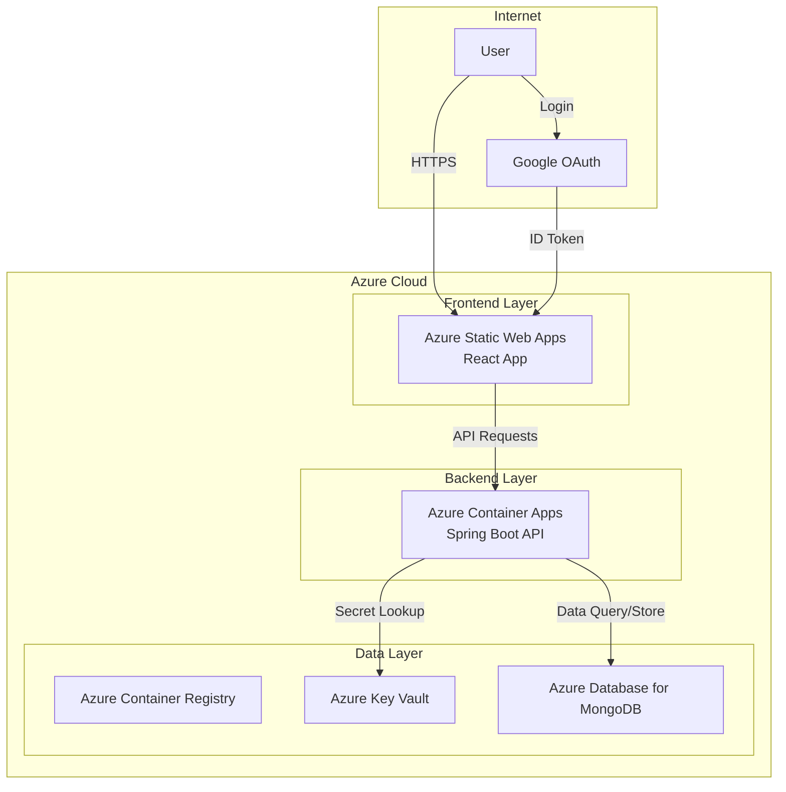

# MyTechPortfolio

<div align="center">


</div>

<div align="center">

> **Sleek and futuristic personal portfolio website**  
> Full-stack portfolio application built with React TypeScript + Spring Boot + MongoDB  
> 🔥 **Live:** https://salieri009.studio

</div>

<div align="center">

[](https://reactjs.org/)
[](https://www.typescriptlang.org/)
[](https://spring.io/projects/spring-boot)
[](https://www.mongodb.com/)
[](LICENSE)
[](https://github.com/salieri009/MyTechPortfolio/graphs/commit-activity)

**Languages:** [English](README.en.md) | [日本語](README.ja.md) | [한국어](README.md)

</div>

---

## 📋 Table of Contents

- [Project Overview](#-project-overview)
- [Key Features](#-key-features)
- [Tech Stack](#-tech-stack)
- [Project Structure](#-project-structure)
- [Quick Start](#-quick-start)
- [Core Features](#-core-features)
- [Deployment Architecture](#-deployment-architecture)
- [Development Guide](#-development-guide)
- [Contributing](#-contributing)
- [Documentation](#-documentation)

---

## 📋 Project Overview

MyTechPortfolio is a personal portfolio website that effectively showcases individual technical capabilities and academic achievements. It provides Google OAuth authentication, MongoDB database, and UX/UI optimized from a recruiter's perspective.

### ✨ Key Features

- 🔐 **Google OAuth Authentication**: Secure and convenient social login system
- 🎨 **Futuristic Design**: Sleek UI utilizing glassmorphism and neomorphism
- 📱 **Fully Responsive**: Mobile-first design supporting all devices
- 🌙 **Dark/Light Mode**: Theme switching based on user preference
- 📊 **Real-time Data**: Dynamic data management based on MongoDB
- 🔍 **Recruiter Optimized**: Structure for recruiters to quickly grasp key information
- 🌍 **Multi-language Support**: Korean, English, and Japanese
- 📧 **Email Integration**: Contact functionality via EmailJS

---

## 🛠️ Tech Stack

### 🎨 Frontend

| Technology | Version | Purpose |
|------------|---------|---------|
| **React** | 18.2.0 | UI Library |
| **TypeScript** | 5.5.3 | Type Safety |
| **Vite** | 5.3.3 | Build Tool |
| **Styled Components** | 6.1.11 | CSS-in-JS |
| **React Router** | 6.23.1 | Routing |
| **Zustand** | 4.5.7 | State Management |
| **i18next** | 25.3.4 | Internationalization |

### ⚙️ Backend

| Technology | Version | Purpose |
|------------|---------|---------|
| **Spring Boot** | 3.3.4 | Web Framework |
| **Java** | 21 | Programming Language |
| **Spring Data MongoDB** | 3.3.4 | MongoDB ORM |
| **Spring Security** | 3.3.4 | Security Framework |
| **MongoDB** | 7.0 | NoSQL Database |
| **Lombok** | 1.18.30 | Code Generation |

### ☁️ Cloud & Deployment

- **Azure Static Web Apps**: Frontend hosting
- **Azure Container Apps**: Backend API server
- **Azure Database for MongoDB**: Production database
- **Azure Key Vault**: Secret management
- **Docker**: Containerization

### 🧪 Testing & Quality

- **Jest**: Unit testing
- **Cypress**: E2E testing
- **ESLint + Prettier**: Code quality and formatting
- **Swagger**: API documentation

---

## 🏗️ Project Structure

```
MyTechPortfolio/
├── frontend/                   # React + TypeScript + Vite
│   ├── src/
│   │   ├── components/         # Reusable UI components
│   │   │   ├── layout/         # Header, footer, layout
│   │   │   ├── sections/       # Main section components
│   │   │   ├── ui/             # Basic UI components
│   │   │   ├── recruiter/      # Recruiter-specific components
│   │   │   └── project/        # Project-related components
│   │   ├── pages/              # Page components
│   │   ├── services/           # API services and business logic
│   │   ├── stores/             # Zustand state management
│   │   ├── hooks/              # Custom React hooks
│   │   ├── types/              # TypeScript type definitions
│   │   ├── styles/             # Global theme and styles
│   │   ├── i18n/               # Internationalization
│   │   └── mocks/              # Development mock data
│   ├── package.json
│   └── vite.config.ts
│
├── backend/                      # Spring Boot + MongoDB
│   ├── src/main/java/
│   │   ├── controller/         # REST API controllers
│   │   ├── service/            # Business logic
│   │   ├── repository/         # MongoDB data access
│   │   ├── domain/             # Domain entities
│   │   ├── security/           # OAuth2 + JWT authentication
│   │   ├── dto/                # Data transfer objects
│   │   ├── config/             # Configuration and initialization
│   │   └── exception/          # Exception handling
│   ├── build.gradle
│   └── src/main/resources/
│       └── application.yml
│
├── docs/                        # Project documentation
│   ├── README.md               # Documentation index
│   ├── Important-Concepts.md   # Key concepts
│   ├── Design-Plan/            # Design documents
│   ├── Specifications/         # Detailed specifications
│   ├── ADR/                    # Architecture Decision Records
│   └── Testing/                # Test results
│
├── design-plan/                 # Design planning
├── docker-compose.dev.yml       # Development Docker configuration
└── README.md                    # Project documentation
```

---

## 🚀 Quick Start

### 📋 Prerequisites

- **Node.js** 18.0.0 or higher
- **Java** 17 or higher (Recommended: Java 21)
- **MongoDB** 7.0 or higher
- **Git** 2.30 or higher
- **Docker** (Optional)

### 1️⃣ Clone the Project

```bash
git clone https://github.com/salieri009/MyTechPortfolio.git
cd MyTechPortfolio
```

### 2️⃣ Run MongoDB

```bash
# Run MongoDB with Docker Compose
docker-compose -f docker-compose.dev.yml up mongodb-dev -d

# Or run local MongoDB
mongod --dbpath /data/db
```

### 3️⃣ Run Backend

```bash
cd backend

# Set environment variables (create backend/.env file)
echo "GOOGLE_CLIENT_ID=your-google-client-id" > .env
echo "GOOGLE_CLIENT_SECRET=your-google-client-secret" >> .env
echo "JWT_SECRET=your-jwt-secret" >> .env
echo "MONGODB_URI=mongodb://localhost:27017/portfolio_dev" >> .env

# Run Spring Boot
./gradlew bootRun
# Windows: gradlew.bat bootRun
```

🌐 Backend Server: http://localhost:8080  
📊 MongoDB: mongodb://localhost:27017/portfolio_dev  
📚 API Documentation (Swagger): http://localhost:8080/swagger-ui.html

### 4️⃣ Run Frontend

```bash
cd frontend

# Set environment variables (create frontend/.env file)
echo "VITE_GOOGLE_CLIENT_ID=your-google-client-id" > .env
echo "VITE_API_BASE_URL=http://localhost:8080/api" >> .env

# Install dependencies and run
npm install
npm run dev
```

🌐 Frontend Server: http://localhost:5173

---

## 🎯 Core Features

### 🔐 Authentication System
- **Google OAuth**: Secure social login
- **JWT Tokens**: Session management and security
- **2FA Support**: Two-factor authentication security

### 📊 Academic Performance Dashboard
- **Real-time GPA/WAM Calculation**: Displays 5.88/7.0, 78.62%
- **Semester-by-semester Performance Trends**: Visualization of grade changes from 2023-2025
- **Subject Details**: 19 subjects with completed/in-progress/exempt status

### 💼 Project Portfolio
- **Technology Filtering**: React, Spring Boot, TypeScript, etc.
- **Progress Tracking**: Distinguishes completed/in-progress projects
- **GitHub Integration**: Links to actual repositories
- **Live Demos**: Experience deployed projects

### 🛠️ Tech Stack Visualization
- **Proficiency Display**: Experience level for each technology
- **Category Classification**: Frontend/Backend/Database/DevOps
- **Trend Analysis**: Adoption rate of latest tech stacks

### 🌍 Multi-language Support
- **Korean**: Default language
- **English**: International user support
- **Japanese**: Preparation for Japanese market entry

---

## ☁️ Deployment Architecture

### 🏗️ Overall System Architecture



### 🎯 Key Components

| Component | Description | Purpose |
|-----------|-------------|---------|
| **Azure Static Web Apps** | React app hosting | Frontend deployment, automatic build/deploy |
| **Azure Container Apps** | Spring Boot API server | Backend execution, auto-scaling |
| **Azure Container Registry** | Docker image repository | Image version management and deployment |
| **Azure Key Vault** | Secret management | Secure storage of environment variables and API keys |
| **Azure Database for MongoDB** | NoSQL database | User data, portfolio information |

---

## 📚 Documentation

Detailed project documentation is available in the `docs/` folder:

- **📖 Documentation Index**: `docs/README.md`
- **🎯 Key Concepts**: `docs/Important-Concepts.md`
- **🎨 Frontend Documentation**: `docs/Design-Plan/Frontend-Design.md`
- **🏗️ Backend Documentation**: `docs/Design-Plan/Backend-Design.md`
- **🏛️ Architecture Design**: `docs/Design-Plan/Architecture-Design.md`
- **🧪 Testing Guide**: `docs/Testing/`
- **📋 Specification Documents**: `docs/Specifications/`

---

## 🤝 Contributing

### 🔧 Development Environment Setup

1. **Fork** and clone locally
2. **Create branch**: `git checkout -b feature/new-feature`
3. **Commit changes**: `git commit -m "feat: add new feature"`
4. **Push**: `git push origin feature/new-feature`
5. **Create Pull Request**

### 📝 Commit Convention

```
feat: add new feature
fix: fix bug
docs: update documentation
style: code formatting
refactor: code refactoring
test: add/update tests
chore: build configuration changes
```

---

## 📈 Current Implementation Status

### ✅ Completed Features

- [x] **Google OAuth Authentication**: Login with Google account
- [x] **Academic Performance System**: Integration of actual UTS grade data
- [x] **Project Showcase**: Detailed information of actual projects
- [x] **Tech Stack Management**: Tech stack logos and classification
- [x] **Futuristic UI/UX**: Glassmorphism design system
- [x] **Responsive Design**: Mobile-first layout
- [x] **Multi-language Support**: Korean, English, Japanese
- [x] **Dark/Light Mode**: Theme switching functionality
- [x] **MongoDB Integration**: NoSQL database integration
- [x] **Visitor Analytics**: Page views and user behavior tracking

### 🔄 In Progress

- [x] **Backend API Integration**: Frontend-backend integration completed
- [ ] **Performance Optimization**: Core Web Vitals improvement
- [ ] **SEO Optimization**: Meta tags and structured data

### 📅 Planned

- [ ] **CI/CD Pipeline**: GitHub Actions automatic deployment
- [ ] **Azure Deployment**: Container Apps + Static Web Apps
- [ ] **Monitoring System**: Azure Monitor integration

---

## 📞 Contact

### 👨‍💻 Developer Information

- **GitHub**: [@salieri009](https://github.com/salieri009)
- **Live Site**: https://salieri009.studio

### 🐛 Issue Reporting

Please report bugs or improvements via [GitHub Issues](https://github.com/salieri009/MyTechPortfolio/issues).

---

## 📄 License

This project is licensed under the [MIT License](LICENSE).

---

## 🙏 Acknowledgments

This project was developed with the help of the following open-source libraries:

- [React](https://reactjs.org/) - UI library
- [Spring Boot](https://spring.io/projects/spring-boot) - Backend framework
- [MongoDB](https://www.mongodb.com/) - NoSQL database
- [Vite](https://vitejs.dev/) - Build tool
- [TypeScript](https://www.typescriptlang.org/) - Type system

---

<div align="center">


**If this project was helpful, please give it a Star**

Made with dedication by **MyTechPortfolio Team**

[](https://github.com/salieri009/MyTechPortfolio/stargazers)
[](https://github.com/salieri009/MyTechPortfolio/network/members)
[](https://github.com/salieri009/MyTechPortfolio/issues)

</div>

