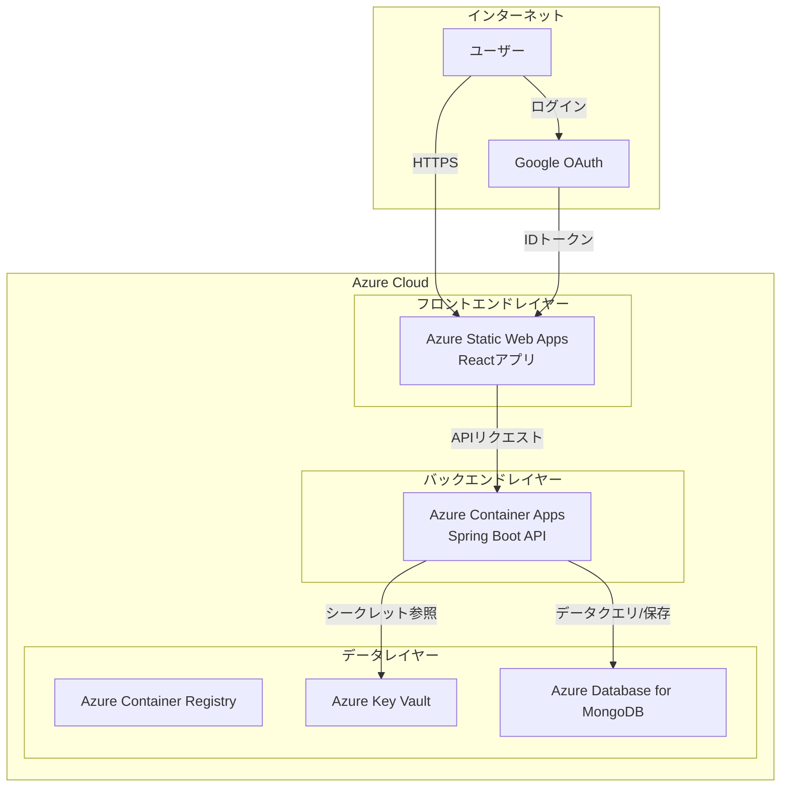

# MyTechPortfolio

<div align="center">


</div>

<div align="center">

> **洗練された未来志向の個人ポートフォリオウェブサイト**  
> React TypeScript + Spring Boot + MongoDBで構築されたフルスタックポートフォリオアプリケーション  
> 🔥 **Live:** https://salieri009.studio

</div>

<div align="center">

[](https://reactjs.org/)
[](https://www.typescriptlang.org/)
[](https://spring.io/projects/spring-boot)
[](https://www.mongodb.com/)
[](LICENSE)
[](https://github.com/salieri009/MyTechPortfolio/graphs/commit-activity)

**言語:** [English](README.en.md) | [日本語](README.ja.md) | [한국어](README.md)

</div>

---

## 📋 目次 (Table of Contents)

- [プロジェクト概要](#-プロジェクト概要)
- [主な特徴](#-主な特徴)
- [技術スタック](#-技術スタック)
- [プロジェクト構造](#-プロジェクト構造)
- [クイックスタート](#-クイックスタート)
- [コア機能](#-コア機能)
- [デプロイメントアーキテクチャ](#-デプロイメントアーキテクチャ)
- [開発ガイド](#-開発ガイド)
- [貢献](#-貢献)
- [ドキュメント](#-ドキュメント)

---

## 📋 プロジェクト概要

MyTechPortfolioは、個人の技術的能力と学業成績を効果的に示すポートフォリオウェブサイトです。Google OAuth認証、MongoDBデータベース、そして採用担当者の視点から最適化されたUX/UIを提供します。

### ✨ 主な特徴

- 🔐 **Google OAuth認証**: 安全で便利なソーシャルログインシステム
- 🎨 **未来志向のデザイン**: グラスモーフィズムとネオモーフィズムを活用した洗練されたUI
- 📱 **完全レスポンシブ**: モバイルファースト設計で全デバイスをサポート
- 🌙 **ダーク/ライトモード**: ユーザーの好みに応じたテーマ切り替え
- 📊 **リアルタイムデータ**: MongoDBベースの動的データ管理
- 🔍 **採用担当者最適化**: 採用担当者が迅速に重要な情報を把握できる構造
- 🌍 **多言語対応**: 韓国語、英語、日本語をサポート
- 📧 **メール連携**: EmailJSによる連絡機能

---

## 🛠️ 技術スタック

### 🎨 フロントエンド

| 技術 | バージョン | 目的 |
|------|-----------|------|
| **React** | 18.2.0 | UIライブラリ |
| **TypeScript** | 5.5.3 | 型安全性 |
| **Vite** | 5.3.3 | ビルドツール |
| **Styled Components** | 6.1.11 | CSS-in-JS |
| **React Router** | 6.23.1 | ルーティング |
| **Zustand** | 4.5.7 | 状態管理 |
| **i18next** | 25.3.4 | 国際化 |

### ⚙️ バックエンド

| 技術 | バージョン | 目的 |
|------|-----------|------|
| **Spring Boot** | 3.3.4 | Webフレームワーク |
| **Java** | 21 | プログラミング言語 |
| **Spring Data MongoDB** | 3.3.4 | MongoDB ORM |
| **Spring Security** | 3.3.4 | セキュリティフレームワーク |
| **MongoDB** | 7.0 | NoSQLデータベース |
| **Lombok** | 1.18.30 | コード生成 |

### ☁️ クラウド & デプロイメント

- **Azure Static Web Apps**: フロントエンドホスティング
- **Azure Container Apps**: バックエンドAPIサーバー
- **Azure Database for MongoDB**: 本番データベース
- **Azure Key Vault**: シークレット管理
- **Docker**: コンテナ化

### 🧪 テスト & 品質

- **Jest**: 単体テスト
- **Cypress**: E2Eテスト
- **ESLint + Prettier**: コード品質とフォーマット
- **Swagger**: APIドキュメント

---

## 🏗️ プロジェクト構造

```
MyTechPortfolio/
├── frontend/                   # React + TypeScript + Vite
│   ├── src/
│   │   ├── components/         # 再利用可能なUIコンポーネント
│   │   │   ├── layout/         # ヘッダー、フッター、レイアウト
│   │   │   ├── sections/       # メインセクションコンポーネント
│   │   │   ├── ui/             # 基本UIコンポーネント
│   │   │   ├── recruiter/      # 採用担当者専用コンポーネント
│   │   │   └── project/         # プロジェクト関連コンポーネント
│   │   ├── pages/              # ページコンポーネント
│   │   ├── services/           # APIサービスとビジネスロジック
│   │   ├── stores/             # Zustand状態管理
│   │   ├── hooks/              # カスタムReactフック
│   │   ├── types/              # TypeScript型定義
│   │   ├── styles/             # グローバルテーマとスタイル
│   │   ├── i18n/               # 国際化
│   │   └── mocks/              # 開発用モックデータ
│   ├── package.json
│   └── vite.config.ts
│
├── backend/                      # Spring Boot + MongoDB
│   ├── src/main/java/
│   │   ├── controller/         # REST APIコントローラー
│   │   ├── service/            # ビジネスロジック
│   │   ├── repository/         # MongoDBデータアクセス
│   │   ├── domain/             # ドメインエンティティ
│   │   ├── security/           # OAuth2 + JWT認証
│   │   ├── dto/                # データ転送オブジェクト
│   │   ├── config/             # 設定と初期化
│   │   └── exception/          # 例外処理
│   ├── build.gradle
│   └── src/main/resources/
│       └── application.yml
│
├── docs/                        # プロジェクトドキュメント
│   ├── README.md               # ドキュメントインデックス
│   ├── Important-Concepts.md  # 重要な概念
│   ├── Design-Plan/            # 設計ドキュメント
│   ├── Specifications/         # 詳細仕様
│   ├── ADR/                    # アーキテクチャ決定記録
│   └── Testing/                # テスト結果
│
├── design-plan/                 # 設計計画
├── docker-compose.dev.yml       # 開発環境Docker設定
└── README.md                    # プロジェクトドキュメント
```

---

## 🚀 クイックスタート

### 📋 前提条件

- **Node.js** 18.0.0以上
- **Java** 17以上（推奨: Java 21）
- **MongoDB** 7.0以上
- **Git** 2.30以上
- **Docker**（オプション）

### 1️⃣ プロジェクトのクローン

```bash
git clone https://github.com/salieri009/MyTechPortfolio.git
cd MyTechPortfolio
```

### 2️⃣ MongoDBの実行

```bash
# Docker ComposeでMongoDBを実行
docker-compose -f docker-compose.dev.yml up mongodb-dev -d

# またはローカルMongoDBを実行
mongod --dbpath /data/db
```

### 3️⃣ バックエンドの実行

```bash
cd backend

# 環境変数の設定（backend/.envファイルを作成）
echo "GOOGLE_CLIENT_ID=your-google-client-id" > .env
echo "GOOGLE_CLIENT_SECRET=your-google-client-secret" >> .env
echo "JWT_SECRET=your-jwt-secret" >> .env
echo "MONGODB_URI=mongodb://localhost:27017/portfolio_dev" >> .env

# Spring Bootの実行
./gradlew bootRun
# Windows: gradlew.bat bootRun
```

🌐 バックエンドサーバー: http://localhost:8080  
📊 MongoDB: mongodb://localhost:27017/portfolio_dev  
📚 APIドキュメント（Swagger）: http://localhost:8080/swagger-ui.html

### 4️⃣ フロントエンドの実行

```bash
cd frontend

# 環境変数の設定（frontend/.envファイルを作成）
echo "VITE_GOOGLE_CLIENT_ID=your-google-client-id" > .env
echo "VITE_API_BASE_URL=http://localhost:8080/api" >> .env

# 依存関係のインストールと実行
npm install
npm run dev
```

🌐 フロントエンドサーバー: http://localhost:5173

---

## 🎯 コア機能

### 🔐 認証システム
- **Google OAuth**: 安全なソーシャルログイン
- **JWTトークン**: セッション管理とセキュリティ
- **2FAサポート**: 二要素認証セキュリティ

### 📊 学業成績ダッシュボード
- **リアルタイムGPA/WAM計算**: 5.88/7.0、78.62%を表示
- **学期別成績推移**: 2023-2025年の成績変化の可視化
- **科目別詳細情報**: 19科目の完了/進行中/免除状態

### 💼 プロジェクトポートフォリオ
- **技術別フィルタリング**: React、Spring Boot、TypeScriptなど
- **進捗状況の追跡**: 完了/進行中プロジェクトの区別
- **GitHub連携**: 実際のリポジトリへのリンク
- **ライブデモ**: デプロイされたプロジェクトの体験

### 🛠️ 技術スタックの可視化
- **習熟度表示**: 各技術の経験レベル
- **カテゴリ分類**: Frontend/Backend/Database/DevOps
- **トレンド分析**: 最新技術スタックの採用率

### 🌍 多言語対応
- **韓国語**: デフォルト言語
- **英語**: 国際ユーザーサポート
- **日本語**: 日本市場進出の準備

---

## ☁️ デプロイメントアーキテクチャ

### 🏗️ 全体システムアーキテクチャ



### 🎯 主要コンポーネント

| コンポーネント | 説明 | 用途 |
|---------------|------|------|
| **Azure Static Web Apps** | Reactアプリのホスティング | フロントエンドのデプロイ、自動ビルド/デプロイ |
| **Azure Container Apps** | Spring Boot APIサーバー | バックエンドの実行、自動スケーリング |
| **Azure Container Registry** | Dockerイメージリポジトリ | イメージのバージョン管理とデプロイ |
| **Azure Key Vault** | シークレット管理 | 環境変数とAPIキーの安全な保存 |
| **Azure Database for MongoDB** | NoSQLデータベース | ユーザーデータ、ポートフォリオ情報 |

---

## 📚 ドキュメント

プロジェクトの詳細ドキュメントは`docs/`フォルダで確認できます：

- **📖 ドキュメントインデックス**: `docs/README.md`
- **🎯 重要な概念**: `docs/Important-Concepts.md`
- **🎨 フロントエンドドキュメント**: `docs/Design-Plan/Frontend-Design.md`
- **🏗️ バックエンドドキュメント**: `docs/Design-Plan/Backend-Design.md`
- **🏛️ アーキテクチャ設計**: `docs/Design-Plan/Architecture-Design.md`
- **🧪 テストガイド**: `docs/Testing/`
- **📋 仕様ドキュメント**: `docs/Specifications/`

---

## 🤝 貢献

### 🔧 開発環境のセットアップ

1. **Fork**してローカルにクローン
2. **ブランチ作成**: `git checkout -b feature/new-feature`
3. **変更をコミット**: `git commit -m "feat: 新機能を追加"`
4. **プッシュ**: `git push origin feature/new-feature`
5. **Pull Requestを作成**

### 📝 コミット規約

```
feat: 新機能を追加
fix: バグ修正
docs: ドキュメント更新
style: コードフォーマット
refactor: コードリファクタリング
test: テスト追加/更新
chore: ビルド設定変更
```

---

## 📈 現在の実装状況

### ✅ 完了した機能

- [x] **Google OAuth認証**: Googleアカウントでログイン
- [x] **学業成績システム**: UTSの実際の成績データの統合
- [x] **プロジェクトショーケース**: 実際のプロジェクトの詳細情報
- [x] **技術スタック管理**: 技術スタックのロゴと分類
- [x] **未来志向のUI/UX**: グラスモーフィズムデザインシステム
- [x] **レスポンシブデザイン**: モバイルファーストレイアウト
- [x] **多言語対応**: 韓国語、英語、日本語
- [x] **ダーク/ライトモード**: テーマ切り替え機能
- [x] **MongoDB統合**: NoSQLデータベース統合
- [x] **訪問者分析**: ページビューとユーザー行動の追跡

### 🔄 進行中

- [x] **バックエンドAPI統合**: フロントエンド-バックエンド統合完了
- [ ] **パフォーマンス最適化**: Core Web Vitalsの改善
- [ ] **SEO最適化**: メタタグと構造化データ

### 📅 計画中

- [ ] **CI/CDパイプライン**: GitHub Actions自動デプロイ
- [ ] **Azureデプロイ**: Container Apps + Static Web Apps
- [ ] **モニタリングシステム**: Azure Monitor統合

---

## 📞 連絡先

### 👨‍💻 開発者情報

- **GitHub**: [@salieri009](https://github.com/salieri009)
- **ライブサイト**: https://salieri009.studio

### 🐛 問題報告

バグや改善点は[GitHub Issues](https://github.com/salieri009/MyTechPortfolio/issues)で報告してください。

---

## 📄 ライセンス

このプロジェクトは[MIT License](LICENSE)の下で公開されています。

---

## 🙏 謝辞

このプロジェクトは以下のオープンソースライブラリの助けを借りて開発されました：

- [React](https://reactjs.org/) - UIライブラリ
- [Spring Boot](https://spring.io/projects/spring-boot) - バックエンドフレームワーク
- [MongoDB](https://www.mongodb.com/) - NoSQLデータベース
- [Vite](https://vitejs.dev/) - ビルドツール
- [TypeScript](https://www.typescriptlang.org/) - 型システム

---

<div align="center">


**このプロジェクトが役に立ったら、Starを押してください**

Made with dedication by **MyTechPortfolio Team**

[](https://github.com/salieri009/MyTechPortfolio/stargazers)
[](https://github.com/salieri009/MyTechPortfolio/network/members)
[](https://github.com/salieri009/MyTechPortfolio/issues)

</div>

