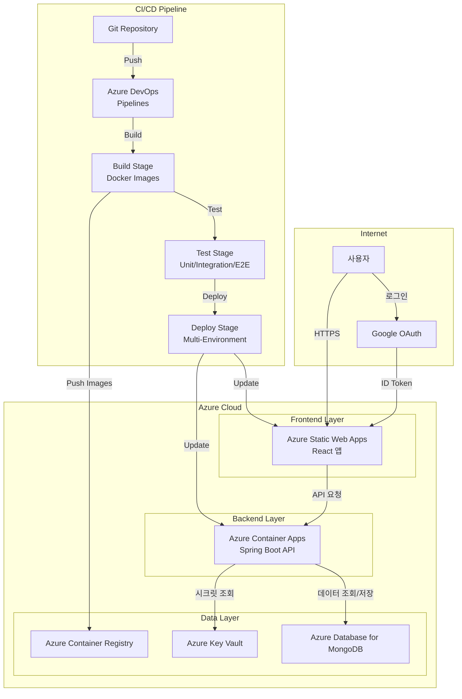

<div align="center">


</div>

<div align="center">

> **세련되고 미래지향적인 개인 포트폴리오 웹사이트**  
> React TypeScript + Spring Boot + MongoDB로 구축된 풀스택 포트폴리오 애플리케이션  
> 🔥 **Live:** https://salieri009.studio

</div>

<div align="center">

[](https://reactjs.org/)
[](https://www.typescriptlang.org/)
[](https://spring.io/projects/spring-boot)
[](https://www.mongodb.com/)
[](LICENSE)
[](https://github.com/salieri009/MyTechPortfolio/graphs/commit-activity)

**다국어 지원:** [English](README.en.md) | [日本語](README.ja.md) | [한국어](README.md)

</div>

---

## 📋 목차 (Table of Contents)

- [프로젝트 개요](#-프로젝트-개요)
- [주요 특징](#-주요-특징)
- [기술 스택](#-기술-스택)
- [프로젝트 구조](#-프로젝트-구조)
- [빠른 시작](#-빠른-시작)
- [핵심 기능](#-핵심-기능)
- [배포 아키텍처](#-배포-아키텍처)
- [CI/CD 파이프라인](#-cicd-파이프라인)
- [개발 가이드](#-개발-가이드)
- [기여하기](#-기여하기)
- [문서](#-문서)

---

## 📋 프로젝트 개요

MyTechPortfolio는 개인의 기술적 역량과 학업 성과를 효과적으로 보여주는 포트폴리오 웹사이트입니다. Google OAuth 인증, MongoDB 데이터베이스, 그리고 채용담당자 관점에서 최적화된 UX/UI를 제공합니다.

### ✨ 주요 특징

- 🔐 **Google OAuth 인증**: 안전하고 편리한 소셜 로그인 시스템
- 🎨 **미래지향적 디자인**: 글래스모피즘과 네오모피즘을 활용한 세련된 UI
- 📱 **완전 반응형**: 모바일 퍼스트 설계로 모든 디바이스 지원
- 🌙 **다크/라이트 모드**: 사용자 선호에 따른 테마 전환
- 📊 **실시간 데이터**: MongoDB 기반 동적 데이터 관리
- 🔍 **채용자 최적화**: 채용담당자가 빠르게 핵심 정보를 파악할 수 있는 구조
- 🌍 **다국어 지원**: 한국어, 영어, 일본어 지원
- 📧 **이메일 연동**: EmailJS를 통한 연락처 기능
- 🔄 **Azure Pipelines CI/CD**: 자동 빌드, 테스트, 배포 파이프라인
- 🛡️ **보안 스캔**: Trivy, Snyk를 통한 취약점 검사
- ✅ **자동 테스트**: 단위/통합/E2E 테스트 자동 실행
- 🚀 **다중 환경 배포**: Dev/Staging/Production 자동 배포

---

## 🛠️ 기술 스택

### 🎨 프론트엔드

| 기술 | 버전 | 목적 |
|------|------|------|
| **React** | 18.2.0 | UI 라이브러리 |
| **TypeScript** | 5.5.3 | 타입 안전성 |
| **Vite** | 5.3.3 | 빌드 도구 |
| **Styled Components** | 6.1.11 | CSS-in-JS |
| **React Router** | 6.23.1 | 라우팅 |
| **Zustand** | 4.5.7 | 상태 관리 |
| **i18next** | 25.3.4 | 다국어 지원 |

### ⚙️ 백엔드

| 기술 | 버전 | 목적 |
|------|------|------|
| **Spring Boot** | 3.3.4 | 웹 프레임워크 |
| **Java** | 21 | 프로그래밍 언어 |
| **Spring Data MongoDB** | 3.3.4 | MongoDB ORM |
| **Spring Security** | 3.3.4 | 보안 프레임워크 |
| **MongoDB** | 7.0 | NoSQL 데이터베이스 |
| **Lombok** | 1.18.30 | 코드 생성 |

### ☁️ 클라우드 & 배포

- **Azure Static Web Apps**: 프론트엔드 호스팅
- **Azure Container Apps**: 백엔드 API 서버
- **Azure Database for MongoDB**: 프로덕션 데이터베이스
- **Azure Key Vault**: 시크릿 관리
- **Azure Container Registry (ACR)**: Docker 이미지 저장소
- **Azure DevOps**: CI/CD 파이프라인 관리
- **Docker**: 컨테이너화

### 🔄 CI/CD & DevOps

| 기술 | 목적 |
|------|------|
| **Azure Pipelines** | CI/CD 자동화 |
| **Trivy** | 컨테이너 보안 스캔 |
| **Snyk** | 의존성 취약점 검사 |
| **Playwright** | E2E 테스트 |
| **JaCoCo** | 코드 커버리지 (Backend) |

### 🧪 테스트 & 품질

- **Jest**: 단위 테스트
- **Playwright**: E2E 테스트
- **ESLint + Prettier**: 코드 품질 및 포맷팅
- **Swagger**: API 문서화

---

## 🏗️ 프로젝트 구조

```
MyTechPortfolio/
├── frontend/                   # React + TypeScript + Vite
│   ├── src/
│   │   ├── components/         # 재사용 가능한 UI 컴포넌트
│   │   │   ├── layout/         # 헤더, 푸터, 레이아웃
│   │   │   ├── sections/       # 메인 섹션 컴포넌트
│   │   │   ├── ui/             # 기본 UI 컴포넌트
│   │   │   ├── recruiter/      # 채용담당자 전용 컴포넌트
│   │   │   └── project/        # 프로젝트 관련 컴포넌트
│   │   ├── pages/              # 페이지 컴포넌트
│   │   ├── services/           # API 서비스 및 비즈니스 로직
│   │   ├── stores/             # Zustand 상태 관리
│   │   ├── hooks/              # 커스텀 React 훅
│   │   ├── types/              # TypeScript 타입 정의
│   │   ├── styles/             # 글로벌 테마 및 스타일
│   │   ├── i18n/               # 다국어 지원
│   │   └── mocks/              # 개발용 목 데이터
│   ├── package.json
│   └── vite.config.ts
│
├── backend/                      # Spring Boot + MongoDB
│   ├── src/main/java/
│   │   ├── controller/         # REST API 컨트롤러
│   │   ├── service/            # 비즈니스 로직
│   │   ├── repository/         # MongoDB 데이터 액세스
│   │   ├── domain/             # 도메인 엔티티
│   │   ├── security/           # OAuth2 + JWT 인증
│   │   ├── dto/                # 데이터 전송 객체
│   │   ├── config/             # 설정 및 초기화
│   │   └── exception/          # 예외 처리
│   ├── build.gradle
│   └── src/main/resources/
│       └── application.yml
│
├── docs/                        # 프로젝트 문서
│   ├── README.md               # 문서 인덱스
│   ├── important-concepts.md   # 핵심 개념
│   ├── design-plan/            # 설계 문서
│   ├── specs/                  # 상세 스펙
│   ├── ADR/                    # 아키텍처 결정 기록
│   └── test-run/               # 테스트 결과
│
├── .azure/                      # Azure Pipelines 설정
│   └── pipelines/
│       ├── templates/          # 재사용 가능한 파이프라인 템플릿
│       └── test-cases/         # 테스트 실행 템플릿
│
├── infra/                       # 인프라 설정
│   └── pipeline-variables.yml  # 파이프라인 변수 문서
│
├── azure-pipelines.yml          # 메인 CI/CD 파이프라인
├── backend/
│   └── azure-pipelines-backend.yml  # 백엔드 전용 파이프라인
├── frontend/
│   └── azure-pipelines-frontend.yml # 프론트엔드 전용 파이프라인
├── design-plan/                 # 설계 계획
├── docker-compose.dev.yml       # 개발 환경 Docker 설정
└── README.md                    # 프로젝트 문서
```

---

## 🚀 빠른 시작

### 📋 사전 요구사항

- **Node.js** 18.0.0 이상
- **Java** 17 이상 (권장: Java 21)
- **MongoDB** 7.0 이상
- **Git** 2.30 이상
- **Docker** (선택사항)

### 1️⃣ 프로젝트 클론

```bash
git clone https://github.com/salieri009/MyTechPortfolio.git
cd MyTechPortfolio
```

### 2️⃣ MongoDB 실행

```bash
# Docker Compose로 MongoDB 실행
docker-compose -f docker-compose.dev.yml up mongodb-dev -d

# 또는 로컬 MongoDB 실행
mongod --dbpath /data/db
```

### 3️⃣ 백엔드 실행

```bash
cd backend

# 환경변수 설정 (backend/.env 파일 생성)
echo "GOOGLE_CLIENT_ID=your-google-client-id" > .env
echo "GOOGLE_CLIENT_SECRET=your-google-client-secret" >> .env
echo "JWT_SECRET=your-jwt-secret" >> .env
echo "MONGODB_URI=mongodb://localhost:27017/portfolio_dev" >> .env

# Spring Boot 실행
./gradlew bootRun
# Windows: gradlew.bat bootRun
```

🌐 백엔드 서버: http://localhost:8080  
📊 MongoDB: mongodb://localhost:27017/portfolio_dev  
📚 API 문서 (Swagger): http://localhost:8080/swagger-ui.html

### 4️⃣ 프론트엔드 실행

```bash
cd frontend

# 환경변수 설정 (frontend/.env 파일 생성)
echo "VITE_GOOGLE_CLIENT_ID=your-google-client-id" > .env
echo "VITE_API_BASE_URL=http://localhost:8080/api" >> .env

# 의존성 설치 및 실행
npm install
npm run dev
```

🌐 프론트엔드 서버: http://localhost:5173

---

## 🎯 핵심 기능

### 🔐 인증 시스템
- **Google OAuth**: 안전한 소셜 로그인
- **JWT 토큰**: 세션 관리 및 보안
- **2FA 지원**: 이중 인증 보안

### 📊 학업 성과 대시보드
- **실시간 GPA/WAM 계산**: 5.88/7.0, 78.62% 표시
- **학기별 성과 추이**: 2023-2025년 성적 변화 시각화
- **과목별 상세 정보**: 19개 과목 완료/진행/면제 상태

### 💼 프로젝트 포트폴리오
- **기술별 필터링**: React, Spring Boot, TypeScript 등
- **진행 상황 추적**: 완료/진행중 프로젝트 구분
- **GitHub 연동**: 실제 레포지토리 링크
- **라이브 데모**: 배포된 프로젝트 체험

### 🛠️ 기술 스택 시각화
- **숙련도 표시**: 각 기술별 경험 수준
- **카테고리 분류**: Frontend/Backend/Database/DevOps
- **트렌드 분석**: 최신 기술 스택 채택률

### 🌍 다국어 지원
- **한국어**: 기본 언어
- **영어**: 국제 사용자 지원
- **일본어**: 일본 시장 진출 준비

---

## ☁️ 배포 아키텍처

### 🏗️ 전체 시스템 아키텍처



### 🎯 주요 구성 요소

| 구성 요소 | 설명 | 용도 |
|-----------|------|------|
| **Azure DevOps** | CI/CD 파이프라인 관리 | 자동 빌드, 테스트, 배포 |
| **Azure Static Web Apps** | React 앱 호스팅 | 프론트엔드 배포, 자동 빌드/배포 |
| **Azure Container Apps** | Spring Boot API 서버 | 백엔드 실행, 자동 스케일링 |
| **Azure Container Registry** | Docker 이미지 저장소 | 이미지 버전 관리 및 자동 배포 |
| **Azure Key Vault** | 시크릿 관리 | 환경변수, API 키 보안 저장 |
| **Azure Database for MongoDB** | NoSQL 데이터베이스 | 사용자 데이터, 포트폴리오 정보 |

---

## 🔄 CI/CD 파이프라인

### 📋 파이프라인 개요

MyTechPortfolio는 Azure Pipelines를 사용한 엔터프라이즈급 CI/CD 파이프라인을 구축했습니다. 20년 경력의 DevOps 및 소프트웨어 엔지니어 모범 사례를 따르며, 다중 환경 배포, 자동화된 테스트, 보안 스캔, 포괄적인 모니터링을 지원합니다.

**파이프라인 구조**: Build → Test → Deploy (3단계)

### 🏗️ 파이프라인 단계

#### 1️⃣ Build Stage (빌드 단계)

- **Docker 이미지 빌드**: Backend 및 Frontend 컨테이너 이미지 생성
- **ACR 푸시**: Azure Container Registry에 이미지 업로드
- **이미지 태깅**: Build ID, Branch Name, Latest 태그 자동 생성
- **빌드 아티팩트**: 빌드 결과물 저장 및 관리

#### 2️⃣ Test Stage (테스트 단계)

- **Backend Unit Tests**: Gradle 기반 단위 테스트 (JaCoCo 커버리지)
- **Backend Integration Tests**: Spring Boot 통합 테스트 (Testcontainers)
- **Frontend Unit Tests**: npm 기반 단위 테스트 (커버리지 리포트)
- **Frontend Integration Tests**: 컴포넌트 통합 테스트
- **Security Scanning**: 
  - Trivy: 컨테이너 이미지 취약점 스캔
  - Snyk: 의존성 취약점 검사
- **E2E Tests**: Playwright 기반 End-to-End 테스트 (main 브랜치)
- **Code Coverage**: 코드 커버리지 리포트 자동 생성

#### 3️⃣ Deploy Stage (배포 단계)

- **Dev Environment**: 
  - 자동 배포 (develop 브랜치)
  - Health Check 및 Smoke Tests 자동 실행
  
- **Staging Environment**: 
  - 자동 배포 (dev 성공 후)
  - 프로덕션 전 최종 검증
  
- **Production Environment**: 
  - 수동 승인 필요 (main 브랜치)
  - 롤백 메커니즘 자동 활성화

### ✨ 주요 기능

- ✅ **자동 빌드 및 테스트**: 코드 푸시 시 자동 실행
- ✅ **보안 스캔 자동화**: 취약점 검사 및 리포트
- ✅ **코드 커버리지 리포트**: 테스트 커버리지 추적
- ✅ **다중 환경 배포**: Dev/Staging/Production 지원
- ✅ **자동 롤백**: 배포 실패 시 이전 버전으로 자동 복구
- ✅ **Health Check**: 배포 후 자동 헬스 체크
- ✅ **Smoke Tests**: 프로덕션 배포 후 기본 기능 검증

### 📁 파이프라인 파일 구조

```
MyTechPortfolio/
├── azure-pipelines.yml              # 메인 파이프라인
├── backend/
│   └── azure-pipelines-backend.yml  # 백엔드 전용 파이프라인
├── frontend/
│   └── azure-pipelines-frontend.yml # 프론트엔드 전용 파이프라인
├── .azure/
│   └── pipelines/
│       ├── templates/               # 재사용 가능한 템플릿
│       │   ├── build-docker-image.yml
│       │   ├── run-tests.yml
│       │   ├── deploy-container-app.yml
│       │   ├── security-scan.yml
│       │   ├── key-vault-integration.yml
│       │   └── monitoring-alerts.yml
│       └── test-cases/              # 테스트 실행 템플릿
│           ├── backend-unit-tests.yml
│           ├── backend-integration-tests.yml
│           ├── frontend-unit-tests.yml
│           ├── frontend-integration-tests.yml
│           ├── api-contract-tests.yml
│           ├── e2e-tests.yml
│           ├── security-tests.yml
│           └── performance-tests.yml
└── infra/
    └── pipeline-variables.yml       # 환경 변수 문서
```

### 🚀 파이프라인 실행

#### 자동 트리거

- **Push to `main`**: 프로덕션 배포 파이프라인 실행
- **Push to `develop`**: 개발 환경 배포 파이프라인 실행
- **Pull Request**: 빌드 및 테스트만 실행 (배포 제외)

#### 수동 실행

Azure DevOps 포털에서 파이프라인을 수동으로 실행할 수 있습니다.

### 📚 상세 문서

파이프라인에 대한 상세한 문서는 다음을 참조하세요:

- **파이프라인 문서**: [`.azure/pipelines/README.md`](.azure/pipelines/README.md)
- **파이프라인 변수**: [`infra/pipeline-variables.yml`](infra/pipeline-variables.yml)
- **구현 계획**: [`.cursor/plans/portfolio-design-enhancement-8f5ea8bd.plan.md`](.cursor/plans/portfolio-design-enhancement-8f5ea8bd.plan.md)

---

## 📚 문서

프로젝트의 상세 문서는 `docs/` 폴더에서 확인할 수 있습니다:

- **📖 문서 인덱스**: `docs/README.md`
- **🎯 핵심 개념**: `docs/important-concepts.md`
- **🎨 프론트엔드 문서**: `docs/design-plan/frontend-design.md`
- **🏗️ 백엔드 문서**: `docs/design-plan/backend-design.md`
- **🏛️ 아키텍처 설계**: `docs/design-plan/architecture-design.md`
- **🔄 CI/CD 파이프라인**: [`.azure/pipelines/README.md`](.azure/pipelines/README.md)
- **⚙️ 파이프라인 변수**: [`infra/pipeline-variables.yml`](infra/pipeline-variables.yml)
- **🧪 테스트 가이드**: `docs/test-run/`
- **📋 스펙 문서**: `docs/specs/`

---

## 🤝 기여하기

### 🔧 개발 환경 설정

1. **Fork** 후 로컬 클론
2. **브랜치 생성**: `git checkout -b feature/새기능`
3. **변경사항 커밋**: `git commit -m "feat: 새로운 기능 추가"`
4. **푸시**: `git push origin feature/새기능`
5. **Pull Request** 생성

### 📝 커밋 컨벤션

```
feat: 새로운 기능 추가
fix: 버그 수정
docs: 문서화
style: 코드 포맷팅
refactor: 코드 리팩토링
test: 테스트 추가/수정
chore: 빌드 설정 변경
```

---

## 📈 현재 구현 상태

### ✅ 완료된 기능

- [x] **Google OAuth 인증**: Google 계정으로 로그인
- [x] **학업 성과 시스템**: UTS 실제 성적 데이터 통합
- [x] **프로젝트 쇼케이스**: 실제 프로젝트 상세 정보
- [x] **기술 스택 관리**: 기술 스택 로고 및 분류
- [x] **미래지향적 UI/UX**: 글래스모피즘 디자인 시스템
- [x] **반응형 디자인**: 모바일-퍼스트 레이아웃
- [x] **다국어 지원**: 한국어, 영어, 일본어
- [x] **다크/라이트 모드**: 테마 전환 기능
- [x] **MongoDB 연동**: NoSQL 데이터베이스 통합
- [x] **방문자 분석**: 페이지 뷰 및 사용자 행동 추적
- [x] **백엔드 API 통합**: 프론트엔드-백엔드 연동 완료
- [x] **Azure Pipelines CI/CD**: 자동 빌드, 테스트, 배포 파이프라인
- [x] **보안 스캔 자동화**: Trivy, Snyk 통합
- [x] **다중 환경 배포**: Dev/Staging/Production 지원
- [x] **자동 롤백**: 배포 실패 시 자동 복구

### 🔄 진행 중

- [ ] **성능 최적화**: Core Web Vitals 개선
- [ ] **SEO 최적화**: 메타 태그 및 구조화된 데이터

### 📅 계획 중

- [ ] **Azure 배포**: Container Apps + Static Web Apps (CI/CD 통합 완료)
- [ ] **모니터링 시스템**: Azure Monitor 연동

---

## 📞 연락처

### 👨‍💻 개발자 정보

- **GitHub**: [@salieri009](https://github.com/salieri009)
- **Live Site**: https://salieri009.studio

### 🐛 이슈 리포팅

버그나 개선사항은 [GitHub Issues](https://github.com/salieri009/MyTechPortfolio/issues)를 통해 제보해 주세요.

---

## 📄 라이선스

이 프로젝트는 [MIT License](LICENSE)로 배포됩니다.

---

## 🙏 감사의 말

이 프로젝트는 다음 오픈소스 라이브러리들의 도움을 받아 개발되었습니다:

- [React](https://reactjs.org/) - UI 라이브러리
- [Spring Boot](https://spring.io/projects/spring-boot) - 백엔드 프레임워크
- [MongoDB](https://www.mongodb.com/) - NoSQL 데이터베이스
- [Vite](https://vitejs.dev/) - 빌드 도구
- [TypeScript](https://www.typescriptlang.org/) - 타입 시스템

---

<div align="center">


**이 프로젝트가 도움이 되셨다면 Star를 눌러주세요**

Made with dedication by **MyTechPortfolio Team**

[](https://github.com/salieri009/MyTechPortfolio/stargazers)
[](https://github.com/salieri009/MyTechPortfolio/network/members)
[](https://github.com/salieri009/MyTechPortfolio/issues)

</div>
