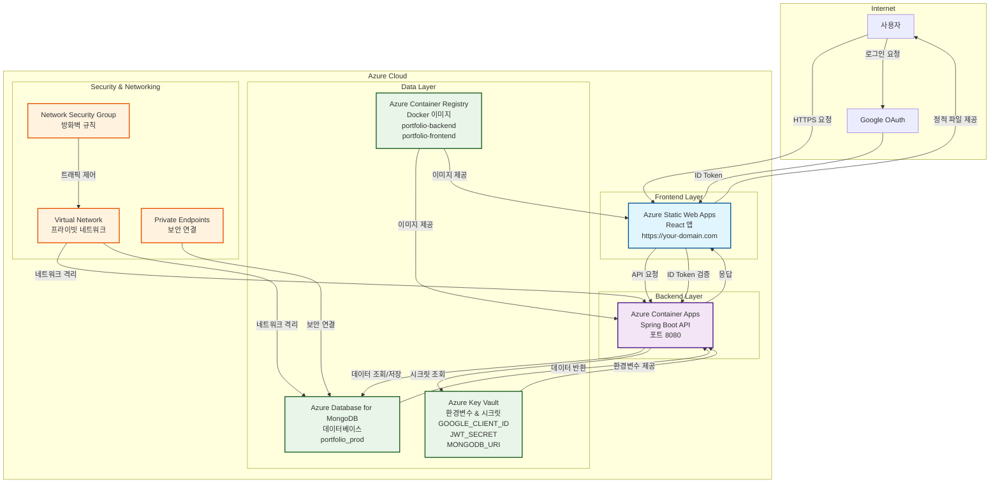
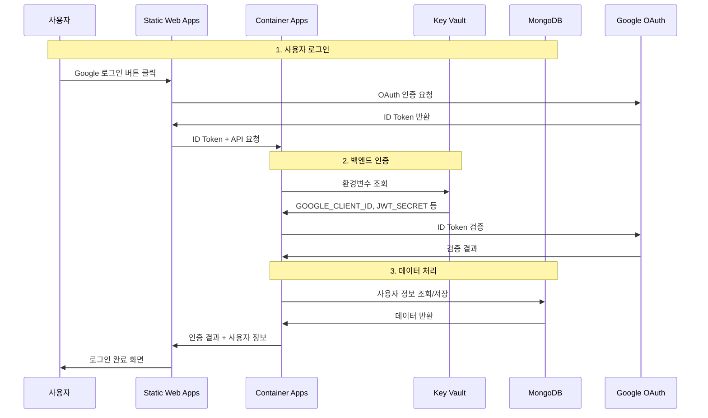

# MyTechPortfolio 🚀

> **세련되고 미래지향적인 개인 포트폴리오 웹사이트**  
> React TypeScript + Spring Boot + MongoDB로 구축된 풀스택 포트폴리오 애플리케이션  
> 🔥 **Live:** https://salieri009.studio

> 📚 Documentation consolidated: the canonical docs are now under the `docs/` folder. Start with `docs/important-concepts.md` for a 5-minute overview and then follow the guided links in `docs/README.md` for deeper design, specs, ADRs and test-run reports.

## 🏷️ 기술 스택 뱃지

### 🎨 프론트엔드
[](https://reactjs.org/)
[](https://www.typescriptlang.org/)
[](https://vitejs.dev/)
[](https://styled-components.com/)

### ⚙️ 백엔드
[](https://spring.io/projects/spring-boot)
[](https://www.oracle.com/java/)
[](https://www.mongodb.com/)

### ☁️ 클라우드 & 배포
[](https://azure.microsoft.com/)
[](https://www.docker.com/)
[](https://github.com/)

### 🧪 테스트 & 품질
[](https://jestjs.io/)
[](https://www.cypress.io/)
[](https://eslint.org/)

### 📊 프로젝트 상태
[](https://opensource.org/licenses/MIT)
[](https://github.com/salieri009/MyTechPortfolio/graphs/commit-activity)
[](https://github.com/salieri009/MyTechPortfolio/pulls)
[](https://github.com/salieri009/MyTechPortfolio)

---

## 📋 프로젝트 개요

MyTechPortfolio는 개인의 기술적 역량과 학업 성과를 효과적으로 보여주는 포트폴리오 웹사이트입니다. Google OAuth 인증, MongoDB 데이터베이스, 그리고 채용담당자 관점에서 최적화된 UX/UI를 제공합니다.

### ✨ 주요 특징

- 🔐 **Google OAuth 인증**: 안전하고 편리한 로그인 시스템
- 🎨 **미래지향적 디자인**: 글래스모피즘과 네오모피즘을 활용한 세련된 UI
- 📱 **완전 반응형**: 모바일 퍼스트 설계로 모든 디바이스 지원
- 🌙 **다크/라이트 모드**: 사용자 선호에 따른 테마 전환
- 📊 **실시간 데이터**: MongoDB 기반 동적 데이터 관리
- 🔍 **채용자 최적화**: 채용담당자가 빠르게 핵심 정보를 파악할 수 있는 구조
- 🌍 **다국어 지원**: 한국어, 영어, 일본어 지원
- 📧 **이메일 연동**: EmailJS를 통한 연락처 기능

---

## 🏗️ 프로젝트 구조

### 📁 전체 구조
```
MyTechPortfolio/
├── 📁 frontend/                   # React + TypeScript + Vite
│   ├── 📁 src/
│   │   ├── 📁 components/         # 재사용 가능한 UI 컴포넌트
│   │   │   ├── 📁 layout/         # 헤더, 푸터, 레이아웃
│   │   │   ├── 📁 sections/       # 메인 섹션 컴포넌트
│   │   │   ├── 📁 ui/             # 기본 UI 컴포넌트
│   │   │   ├── 📁 recruiter/      # 채용담당자 전용 컴포넌트
│   │   │   └── 📁 project/        # 프로젝트 관련 컴포넌트
│   │   ├── 📁 pages/              # 페이지 컴포넌트
│   │   ├── 📁 services/           # API 서비스 및 비즈니스 로직
│   │   ├── 📁 stores/             # Zustand 상태 관리
│   │   ├── 📁 hooks/              # 커스텀 React 훅
│   │   ├── 📁 types/              # TypeScript 타입 정의
│   │   ├── 📁 styles/             # 글로벌 테마 및 스타일
│   │   ├── 📁 i18n/               # 다국어 지원
│   │   └── 📁 mocks/              # 개발용 목 데이터
├── 📁 backend/                    # Spring Boot + MongoDB
│   ├── 📁 src/main/java/
│   │   ├── 📁 controller/         # REST API 컨트롤러
│   │   ├── 📁 service/            # 비즈니스 로직
│   │   ├── 📁 repository/         # MongoDB 데이터 액세스
│   │   ├── 📁 domain/             # 도메인 엔티티
│   │   ├── 📁 security/           # OAuth2 + JWT 인증
│   │   ├── 📁 dto/                # 데이터 전송 객체
│   │   ├── 📁 config/             # 설정 및 초기화
│   │   └── 📁 exception/          # 예외 처리
├── 📁 design-plan/                # 설계 문서 및 계획
├── 📁 docker-compose.dev.yml      # 개발 환경 Docker 설정
└── 📄 README.md                   # 프로젝트 문서
```

---

## 🚀 빠른 시작

### 📋 사전 요구사항

- **Node.js** 18.0.0 이상
- **Java** 17 이상 (권장: Java 23)
- **MongoDB** 7.0 이상
- **Git** 2.30 이상

### 1️⃣ 프로젝트 클론

```bash
git clone https://github.com/salieri009/MyTechPortfolio.git
cd MyTechPortfolio
```

### 2️⃣ MongoDB 실행

```bash
# Docker Compose로 MongoDB 실행
docker-compose -f docker-compose.dev.yml up mongodb-dev -d

# 또는 로컬 MongoDB 실행
mongod --dbpath /data/db
```

### 3️⃣ 백엔드 실행

```bash
cd backend

# 환경변수 설정 (backend/.env 파일 생성)
echo "GOOGLE_CLIENT_ID=your-google-client-id" > .env
echo "GOOGLE_CLIENT_SECRET=your-google-client-secret" >> .env
echo "JWT_SECRET=your-jwt-secret" >> .env

# Spring Boot 실행
./gradlew bootRun
# Windows: gradlew.bat bootRun
```

🌐 백엔드 서버: http://localhost:8080  
📊 MongoDB: mongodb://localhost:27017/portfolio_dev  
📚 API 문서 (Swagger): http://localhost:8080/api/swagger-ui.html

### 4️⃣ 프론트엔드 실행

```bash
cd frontend

# 환경변수 설정 (frontend/.env 파일 생성)
echo "VITE_GOOGLE_CLIENT_ID=your-google-client-id" > .env
echo "VITE_API_BASE_URL=/api" >> .env

# 의존성 설치 및 실행
npm install
npm run dev
```

🌐 프론트엔드 서버: http://localhost:5173

---

## 📈 현재 구현 상태

### ✅ 완료된 기능

- [x] **Google OAuth 인증**: Google 계정으로 로그인
- [x] **학업 성과 시스템**: UTS 실제 성적 데이터 통합 (GPA 5.88, WAM 78.62)
- [x] **프로젝트 쇼케이스**: 7개 실제 프로젝트 상세 정보
- [x] **기술 스택 관리**: 20+ 기술 스택 로고 및 분류
- [x] **미래지향적 UI/UX**: 글래스모피즘 디자인 시스템
- [x] **반응형 디자인**: 모바일-퍼스트 레이아웃
- [x] **다국어 지원**: 한국어, 영어, 일본어
- [x] **다크/라이트 모드**: 테마 전환 기능
- [x] **MongoDB 연동**: NoSQL 데이터베이스 통합
- [x] **방문자 분석**: 페이지 뷰 및 사용자 행동 추적

### 🔄 진행 중

- [x] **백엔드 API 통합**: 프론트엔드-백엔드 연동 완료
- [ ] **성능 최적화**: Core Web Vitals 개선
- [ ] **SEO 최적화**: 메타 태그 및 구조화된 데이터

### 📅 계획 중

- [ ] **CI/CD 파이프라인**: GitHub Actions 자동 배포
- [ ] **Azure 배포**: Container Apps + Static Web Apps
- [ ] **모니터링 시스템**: Azure Monitor 연동

---

## 🎯 핵심 기능

### 🔐 인증 시스템
- **Google OAuth**: 안전한 소셜 로그인
- **JWT 토큰**: 세션 관리 및 보안
- **2FA 지원**: 이중 인증 보안

### 📊 학업 성과 대시보드
- **실시간 GPA/WAM 계산**: 5.88/7.0, 78.62% 표시
- **학기별 성과 추이**: 2023-2025년 성적 변화 시각화
- **과목별 상세 정보**: 19개 과목 완료/진행/면제 상태

### 💼 프로젝트 포트폴리오
- **기술별 필터링**: React, Spring Boot, TypeScript 등
- **진행 상황 추적**: 완료/진행중 프로젝트 구분
- **GitHub 연동**: 실제 레포지토리 링크
- **라이브 데모**: 배포된 프로젝트 체험

### 🛠️ 기술 스택 시각화
- **숙련도 표시**: 각 기술별 경험 수준
- **카테고리 분류**: Frontend/Backend/Database/DevOps
- **트렌드 분석**: 최신 기술 스택 채택률

### 🌍 다국어 지원
- **한국어**: 기본 언어
- **영어**: 국제 사용자 지원
- **일본어**: 일본 시장 진출 준비

---

## ☁️ Azure 배포 아키텍처

### 🏗️ 전체 시스템 아키텍처



### 🔄 데이터 흐름 시퀀스



### 🎯 주요 구성 요소

| 구성 요소 | 설명 | 용도 |
|-----------|------|------|
| **Azure Static Web Apps** | React 앱 호스팅 | 프론트엔드 배포, 자동 빌드/배포 |
| **Azure Container Apps** | Spring Boot API 서버 | 백엔드 실행, 자동 스케일링 |
| **Azure Container Registry** | Docker 이미지 저장소 | 이미지 버전 관리 및 배포 |
| **Azure Key Vault** | 시크릿 관리 | 환경변수, API 키 보안 저장 |
| **Azure Database for MongoDB** | NoSQL 데이터베이스 | 사용자 데이터, 포트폴리오 정보 |

### 🔒 보안 및 네트워킹

- **Virtual Network**: 리소스 간 격리 및 보안
- **Private Endpoints**: 데이터베이스 보안 연결
- **Network Security Groups**: 트래픽 제어 및 방화벽
- **HTTPS**: SSL 인증서로 모든 통신 암호화

### 💰 비용 최적화

#### 개발/테스트 환경
- Container Apps: 소규모 인스턴스
- MongoDB: Basic 티어
- Static Web Apps: Free 티어

#### 프로덕션 환경
- Container Apps: Premium 티어
- MongoDB: Standard 티어
- Key Vault: Standard 티어

---

## 🧪 테스팅 프레임워크

MyTechPortfolio는 포괄적인 테스팅 전략을 제공합니다:

| 테스트 유형 | 범위 | 도구 |
|-------------|------|------|
| **API 엔드포인트** | REST API 기능 검증 | curl, Postman |
| **데이터베이스 CRUD** | MongoDB 엔티티 무결성 | MongoDB Compass, JUnit |
| **프론트엔드-백엔드 통합** | 전체 데이터 흐름 | Cypress, Jest |
| **사용자 시나리오** | End-to-End 사용성 | 페르소나 기반 테스트 |
| **에러 핸들링** | 예외 상황 대응 | 의도적 오류 발생 |
| **성능 최적화** | Core Web Vitals | Lighthouse, WebPageTest |

### 📋 테스트 실행 가이드

```bash
# 백엔드 테스트
cd backend
./gradlew test

# 프론트엔드 테스트  
cd frontend
npm run test
npm run test:e2e

# 성능 테스트
npm run lighthouse
npm run bundle-analyzer
```

---

## 🌐 브랜치 전략

```
master              # 🏭 프로덕션 배포
├── dev             # 🔧 개발 통합
│   ├── frontend-dev    # ⚛️ 프론트엔드 개발
│   ├── backend-dev     # ☕ 백엔드 개발
│   └── planning        # 📋 기획 및 문서화
└── hotfix          # 🚨 긴급 수정
```

### 🔄 개발 워크플로우

1. **기능 개발**: `feature/기능명` 브랜치에서 개발
2. **통합 테스트**: `dev` 브랜치에서 기능 통합
3. **품질 검증**: 테스팅 프레임워크로 검증
4. **프로덕션 배포**: `master` 브랜치로 병합

---

## 📊 기술 스택

### 🎨 프론트엔드

| 기술 | 버전 | 목적 |
|------|------|------|
| **React** | 18.2.0 | UI 라이브러리 |
| **TypeScript** | 5.5.3 | 타입 안전성 |
| **Vite** | 5.3.3 | 빌드 도구 |
| **Styled Components** | 6.1.11 | CSS-in-JS |
| **React Router** | 6.23.1 | 라우팅 |
| **Zustand** | 4.5.7 | 상태 관리 |
| **i18next** | 25.3.4 | 다국어 지원 |

### ⚙️ 백엔드

| 기술 | 버전 | 목적 |
|------|------|------|
| **Spring Boot** | 3.3.4 | 웹 프레임워크 |
| **Java** | 23 | 프로그래밍 언어 |
| **Spring Data MongoDB** | 3.3.4 | MongoDB ORM |
| **Spring Security** | 3.3.4 | 보안 프레임워크 |
| **MongoDB** | 7.0 | NoSQL 데이터베이스 |
| **Lombok** | 1.18.28 | 코드 생성 |

### 🛠️ 개발 도구

| 도구 | 목적 |
|------|------|
| **ESLint + Prettier** | 코드 품질 및 포맷팅 |
| **Husky** | Git 훅 관리 |
| **Jest + Testing Library** | 단위 테스트 |
| **Cypress** | E2E 테스트 |
| **Swagger** | API 문서화 |
| **MongoDB Compass** | MongoDB GUI 도구 |

---

## 🎨 디자인 시스템

### 🎨 컬러 팔레트

```typescript
// Primary - Electric Blue
primary: {
  500: '#3b82f6',  // 메인 브랜드 컬러
  600: '#2563eb',  // 호버 상태
}

// Secondary - Cyber Purple  
secondary: {
  500: '#a855f7',  // 보조 브랜드 컬러
  600: '#9333ea',  // 액센트
}

// Accent - Neon Green
accent: {
  500: '#22c55e',  // 강조 컬러
  600: '#16a34a',  // 성공 상태
}
```

### 📱 반응형 브레이크포인트

```typescript
breakpoints: {
  xs: '475px',   // 📱 모바일
  sm: '640px',   // 📱 큰 모바일
  md: '768px',   // 📟 태블릿
  lg: '1024px',  // 💻 데스크톱
  xl: '1280px',  // 🖥️ 큰 데스크톱
  '2xl': '1536px' // 🖥️ 와이드 모니터
}
```

---

## 📈 성능 지표

### 🌟 Core Web Vitals 목표

| 지표 | 목표 | 현재 |
|------|------|------|
| **FCP** (First Contentful Paint) | < 1.5s | 측정 중 |
| **LCP** (Largest Contentful Paint) | < 2.5s | 측정 중 |
| **FID** (First Input Delay) | < 100ms | 측정 중 |
| **CLS** (Cumulative Layout Shift) | < 0.1 | 측정 중 |

### 📊 성능 최적화 전략

- **코드 분할**: 라우트별 지연 로딩
- **이미지 최적화**: WebP 포맷 + 지연 로딩
- **캐싱 전략**: API 응답 및 정적 리소스 캐시
- **번들 최적화**: Tree shaking + 압축

---

## 🤝 기여 가이드

### 🔧 개발 환경 설정

1. **Fork** 후 로컬 클론
2. **브랜치 생성**: `git checkout -b feature/새기능`
3. **변경사항 커밋**: `git commit -m "feat: 새로운 기능 추가"`
4. **푸시**: `git push origin feature/새기능`
5. **Pull Request** 생성

### 📝 커밋 컨벤션

```
feat: 새로운 기능 추가
fix: 버그 수정
docs: 문서화
style: 코드 포맷팅
refactor: 코드 리팩토링
test: 테스트 추가/수정
chore: 빌드 설정 변경
```

---

## 📞 연락처

### 👨‍💻 개발자 정보

- **이름**: [개발자명]
- **이메일**: [이메일 주소]
- **GitHub**: [@salieri009](https://github.com/salieri009)
- **LinkedIn**: [LinkedIn 프로필]

### 🐛 이슈 리포팅

버그나 개선사항은 [GitHub Issues](https://github.com/salieri009/MyTechPortfolio/issues)를 통해 제보해 주세요.

---

## 📄 라이선스

이 프로젝트는 [MIT License](LICENSE)로 배포됩니다.

---

## 🙏 감사의 말

이 프로젝트는 다음 오픈소스 라이브러리들의 도움을 받아 개발되었습니다:

- [React](https://reactjs.org/) - UI 라이브러리
- [Spring Boot](https://spring.io/projects/spring-boot) - 백엔드 프레임워크
- [MongoDB](https://www.mongodb.com/) - NoSQL 데이터베이스
- [Vite](https://vitejs.dev/) - 빌드 도구
- [TypeScript](https://www.typescriptlang.org/) - 타입 시스템

---

<div align="center">

**⭐ 이 프로젝트가 도움이 되셨다면 Star를 눌러주세요! ⭐**

Made with ❤️ by **MyTechPortfolio Team**

</div>

