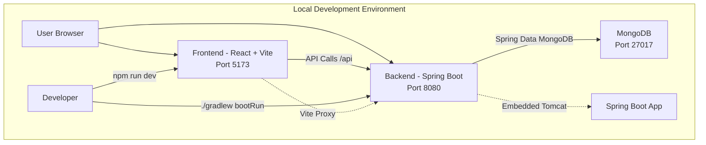
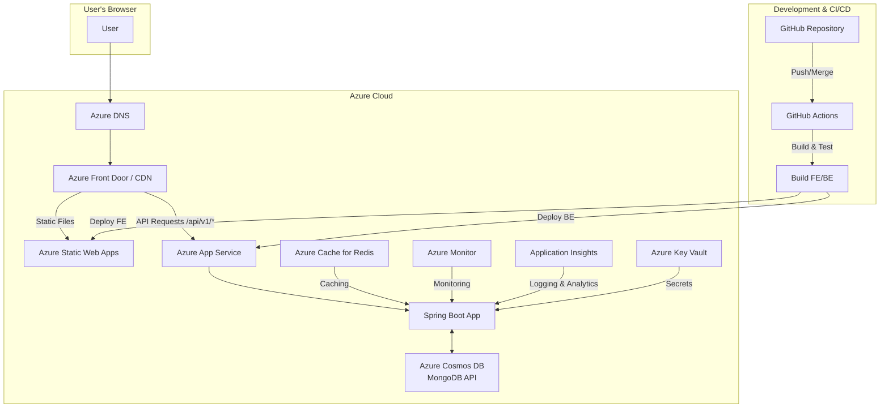
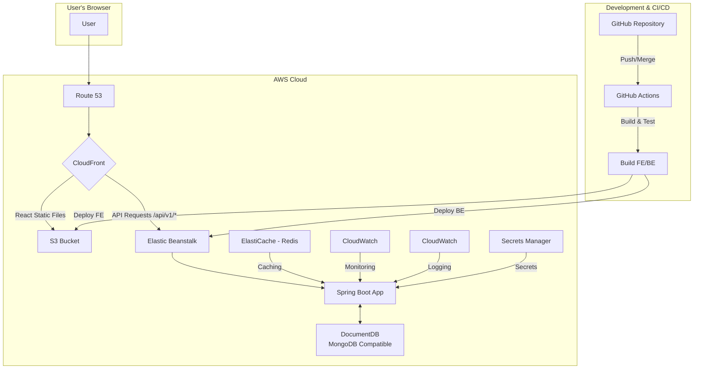
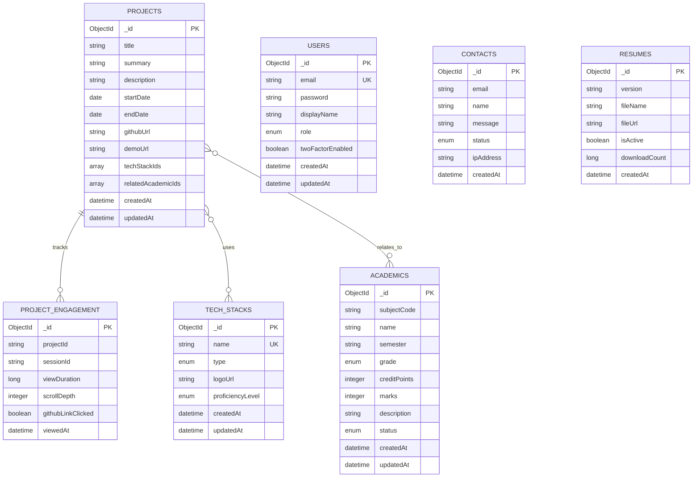

# 아키텍처 기획안 (Architecture Design Plan)

> **Version**: 2.0.0  
> **Last Updated**: 2025-11-15  
> **Status**: Production Implementation Complete

## 1. 개요 (Overview)

본 프로젝트는 현재 로컬 개발 환경에서 완전히 구현된 포트폴리오 웹사이트로, 향후 확장성, 안정성, 그리고 유지보수성을 고려하여 클라우드 환경(Azure 또는 AWS)에 최적화된 아키텍처로 배포할 수 있도록 설계되었습니다. 프론트엔드와 백엔드를 분리하여 개발하고, CI/CD 파이프라인을 통해 배포 프로세스를 자동화하여 개발 생산성을 극대화하는 것을 목표로 합니다.

## 2. 현재 구현된 시스템 아키텍처

### 로컬 개발 환경 구성



### 현재 기술 스택

| Category | Technology | Version | Purpose |
|----------|-----------|---------|---------|
| **Frontend** | React | 18.2.0 | UI Framework |
| **Frontend** | TypeScript | 5.5.3 | Type Safety |
| **Frontend** | Vite | 5.3.3 | Build Tool & Dev Server |
| **Frontend** | Styled Components | 6.1.11 | CSS-in-JS |
| **Frontend** | Zustand | 4.5.7 | State Management |
| **Backend** | Spring Boot | 3.3.4 | Application Framework |
| **Backend** | Java | 21 | Programming Language |
| **Database** | MongoDB | Latest | NoSQL Document Database |
| **ODM** | Spring Data MongoDB | 3.3.4 | Object-Document Mapping |
| **API Docs** | SpringDoc OpenAPI | 2.2.0 | API Documentation |
| **Build Tool** | Gradle | 8.10.2 | Backend Build |
| **Build Tool** | npm | Latest | Frontend Build |
| **Security** | Spring Security | 6.x | Authentication & Authorization |
| **Security** | JWT | 0.12.3 | Token-based Auth |
| **Security** | Google OAuth | 2.0 | Social Login |

### 주요 구현된 기능

1. **포트폴리오 관리**: 프로젝트, 학업 정보, 기술 스택 CRUD
2. **인증 및 인가**: Google OAuth + JWT + 2FA 지원
3. **연락처 관리**: Contact form with spam protection
4. **이력서 관리**: Multiple resume versions with download tracking
5. **프로젝트 참여도 분석**: Engagement tracking and analytics
6. **국제화**: React i18next를 통한 다국어 지원 (한국어, 영어, 일본어)
7. **반응형 디자인**: 모든 디바이스에서 완벽한 사용자 경험
8. **API 버전 관리**: `/api/v1` 기반 RESTful API

## 3. 프로덕션 배포 아키텍처 (Production Deployment Architecture)

### Azure 배포 아키텍처 (Primary)



### AWS 배포 아키텍처 (Alternative)



### 아키텍처 구성 요소 설명

#### Azure 구성 요소

- **Azure DNS**: 도메인 이름 관리 및 라우팅
- **Azure Front Door / CDN**: 글로벌 CDN 및 라우팅
- **Azure Static Web Apps**: React 정적 파일 호스팅
- **Azure App Service**: Spring Boot 애플리케이션 배포 (PaaS)
- **Azure Cosmos DB (MongoDB API)**: 관리형 MongoDB 데이터베이스
- **Azure Cache for Redis**: 인메모리 캐싱
- **Azure Monitor**: 애플리케이션 모니터링
- **Application Insights**: 로깅 및 성능 분석
- **Azure Key Vault**: 비밀 정보 관리

#### AWS 구성 요소

- **Route 53**: DNS 서비스
- **CloudFront**: CDN 및 SSL/TLS 인증서
- **S3**: 정적 파일 호스팅
- **Elastic Beanstalk**: Spring Boot 애플리케이션 배포
- **DocumentDB**: MongoDB 호환 데이터베이스
- **ElastiCache (Redis)**: 인메모리 캐싱
- **CloudWatch**: 모니터링 및 로깅
- **Secrets Manager**: 비밀 정보 관리

## 4. 데이터베이스 아키텍처

### MongoDB 컬렉션 구조



### 관계 설명

- **Project ↔ TechStack**: Many-to-Many via `techStackIds` array (embedded references)
- **Project ↔ Academic**: Many-to-Many via `relatedAcademicIds` array (embedded references)
- **Project → ProjectEngagement**: One-to-Many (project engagement tracking)
- **User**: Standalone collection for authentication
- **Contact**: Standalone collection for contact form submissions
- **Resume**: Standalone collection for resume management

### 인덱스 전략

| Collection | Index | Type | Purpose |
|------------|-------|------|---------|
| `projects` | `endDate` | DESC | Sorting by date |
| `projects` | `isFeatured` | ASC | Featured projects |
| `academics` | `subjectCode` | ASC | Quick lookup |
| `academics` | `semester` | ASC | Semester filtering |
| `tech_stacks` | `name` | UNIQUE | Uniqueness & lookup |
| `users` | `email` | UNIQUE | Authentication |
| `contacts` | `email` | ASC | Duplicate detection |
| `resumes` | `isActive` | ASC | Primary resume |

## 5. 배포 전략 (Deployment Strategy)

### 가. 프론트엔드 (Frontend - React)

#### Azure Static Web Apps

1. **빌드**: `npm run build` → `dist/` 디렉터리 생성
2. **최적화**: 
   - Vite 번들 최적화
   - Tree Shaking
   - Code Splitting (route-based)
   - Image optimization
3. **배포**: GitHub Actions를 통한 자동 배포
4. **CDN**: Azure Front Door를 통한 글로벌 CDN

#### AWS S3 + CloudFront

1. **빌드**: `npm run build` → `dist/` 디렉터리 생성
2. **업로드**: S3 버킷에 정적 파일 업로드
3. **호스팅**: S3 정적 웹사이트 호스팅 활성화
4. **CDN**: CloudFront 배포 및 캐시 무효화

### 나. 백엔드 (Backend - Spring Boot)

#### Azure App Service

1. **빌드**: `./gradlew build` → JAR 파일 생성
2. **테스트**: 단위 테스트 및 통합 테스트 자동 실행
3. **배포**: Azure App Service에 JAR 파일 배포
4. **환경 변수**: Azure Key Vault에서 비밀 정보 주입
5. **스케일링**: 자동 스케일링 설정

#### AWS Elastic Beanstalk

1. **빌드**: `./gradlew build` → JAR 파일 생성
2. **테스트**: 단위 테스트 및 통합 테스트 자동 실행
3. **배포**: Elastic Beanstalk에 JAR 파일 업로드
4. **환경 변수**: AWS Secrets Manager에서 비밀 정보 주입
5. **스케일링**: 오토 스케일링 그룹 설정

### 다. 데이터베이스

#### Azure Cosmos DB (MongoDB API)

- **장점**: 글로벌 분산, 자동 스케일링, SLA 보장
- **연결**: MongoDB 연결 문자열 사용
- **백업**: 자동 백업 및 Point-in-Time 복구

#### AWS DocumentDB

- **장점**: MongoDB 호환, 관리형 서비스
- **연결**: MongoDB 연결 문자열 사용
- **백업**: 자동 백업 및 스냅샷

#### 로컬 개발

- **MongoDB**: 로컬 MongoDB 인스턴스 (Port 27017)
- **연결 문자열**: `mongodb://localhost:27017/portfolio`

## 6. CI/CD 파이프라인 (CI/CD Pipeline with GitHub Actions)

### 워크플로우 구조

```yaml
name: Deploy Portfolio

on:
  push:
    branches: [ main ]
  pull_request:
    branches: [ main ]

jobs:
  backend:
    runs-on: ubuntu-latest
    steps:
      - uses: actions/checkout@v3
      - name: Set up JDK 21
        uses: actions/setup-java@v3
        with:
          java-version: '21'
      - name: Run tests
        run: ./gradlew test
      - name: Build
        run: ./gradlew build
      - name: Deploy to Azure App Service
        uses: azure/webapps-deploy@v2
        with:
          app-name: portfolio-backend
          package: build/libs/*.jar

  frontend:
    runs-on: ubuntu-latest
    steps:
      - uses: actions/checkout@v3
      - name: Set up Node.js
        uses: actions/setup-node@v3
        with:
          node-version: '18'
      - name: Install dependencies
        run: npm ci
      - name: Build
        run: npm run build
      - name: Deploy to Azure Static Web Apps
        uses: Azure/static-web-apps-deploy@v1
        with:
          azure_static_web_apps_api_token: ${{ secrets.AZURE_STATIC_WEB_APPS_API_TOKEN }}
          repo_token: ${{ secrets.GITHUB_TOKEN }}
          app_location: "/frontend"
          output_location: "dist"
```

### 배포 프로세스

1. **Trigger**: `main` 브랜치에 Push 또는 Merge
2. **Backend CI/CD**:
   - Java 21 및 Gradle 환경 설정
   - `./gradlew test`: 단위 테스트 실행
   - `./gradlew build`: JAR 파일 생성
   - Azure App Service 또는 Elastic Beanstalk에 배포
3. **Frontend CI/CD**:
   - Node.js 및 npm 환경 설정
   - `npm ci`: 의존성 설치
   - `npm run build`: React 프로젝트 빌드
   - Azure Static Web Apps 또는 S3에 배포
   - CDN 캐시 무효화

## 7. 보안 및 성능 고려사항

### 보안

#### 구현된 보안 기능

- **JWT 인증**: Access Token (1시간) + Refresh Token (7일)
- **Google OAuth 2.0**: Social login 지원
- **2FA**: TOTP 기반 2단계 인증
- **Spring Security**: SecurityFilterChain 구성
- **CORS**: 환경별 허용 오리진 설정
- **Security Headers**: HSTS, X-Frame-Options, Content-Type-Options
- **Input Sanitization**: `InputSanitizer`를 통한 XSS 방지
- **Rate Limiting**: Contact API에 Rate Limiting (구현 예정)

#### 보안 헤더

```java
.headers(headers -> headers
    .contentTypeOptions(cto -> cto.and())
    .httpStrictTransportSecurity(hsts -> hsts
        .maxAgeInSeconds(31536000)
        .includeSubdomains(true)
    )
    .frameOptions(fo -> fo.deny())
    .referrerPolicy(rp -> rp.policy(ReferrerPolicyHeaderWriter.ReferrerPolicy.STRICT_ORIGIN_WHEN_CROSS_ORIGIN))
)
```

### 성능 최적화

#### 프론트엔드

- **CDN**: Azure Front Door / CloudFront를 통한 정적 자산 캐싱
- **Code Splitting**: Route-based lazy loading
- **Image Optimization**: WebP 포맷, lazy loading
- **Bundle Optimization**: Tree Shaking, Minification

#### 백엔드

- **Redis 캐싱**: TechStackService 캐싱 (1시간 TTL)
- **데이터베이스 최적화**: 
  - 인덱스 설정
  - 쿼리 최적화
  - Connection pooling
- **API 응답 최적화**: 
  - Pagination
  - DTO projection
  - 필드 선택적 반환

### 모니터링

#### Azure

- **Azure Monitor**: 애플리케이션 성능 모니터링
- **Application Insights**: 
  - 로깅 및 추적
  - 성능 메트릭
  - 예외 추적
- **Log Analytics**: 중앙화된 로그 관리

#### AWS

- **CloudWatch**: 
  - 애플리케이션 로그
  - 메트릭 수집
  - 알람 설정
- **X-Ray**: 분산 추적 (선택적)

## 8. 확장성 고려사항

### 수평 확장 (Horizontal Scaling)

- **Frontend**: CDN을 통한 자동 확장
- **Backend**: 
  - Azure App Service: 자동 스케일링
  - AWS Elastic Beanstalk: 오토 스케일링 그룹
- **Database**: 
  - Azure Cosmos DB: 자동 분할 및 확장
  - AWS DocumentDB: 읽기 복제본

### 수직 확장 (Vertical Scaling)

- **App Service Plan**: 더 높은 티어로 업그레이드
- **Database**: 더 높은 성능 티어로 업그레이드

### 캐싱 전략

- **Redis**: 
  - TechStack 데이터 캐싱
  - 세션 데이터 (선택적)
  - Rate limiting 데이터

## 9. 재해 복구 (Disaster Recovery)

### 백업 전략

- **Database**: 
  - Azure Cosmos DB: 자동 백업 (7일 보관)
  - AWS DocumentDB: 자동 스냅샷
- **Application**: 
  - GitHub 저장소에 소스 코드 백업
  - 빌드 아티팩트 저장

### 복구 절차

1. **Database 복구**: Point-in-Time 복구 또는 스냅샷 복원
2. **Application 복구**: GitHub에서 코드 재배포
3. **DNS 복구**: DNS 레코드 복구

## 10. 비용 최적화

### Azure

- **Static Web Apps**: 무료 티어 제공
- **App Service**: Basic 티어부터 시작
- **Cosmos DB**: 요청 단위(RU) 기반 과금

### AWS

- **S3**: 사용량 기반 과금
- **Elastic Beanstalk**: EC2 인스턴스 비용
- **DocumentDB**: 인스턴스 기반 과금

### 최적화 전략

- **CDN 캐싱**: 캐시 히트율 최대화
- **Database 최적화**: 쿼리 최적화로 RU 절감
- **Auto Scaling**: 필요시에만 스케일 업

---

**Document Version**: 2.0.0  
**Last Updated**: 2025-11-15  
**Maintained By**: Development Team
