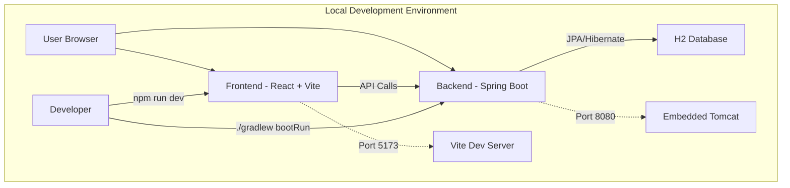
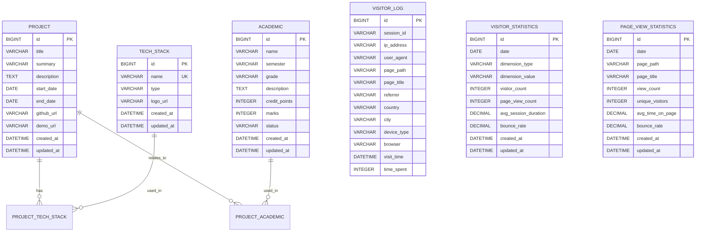

# 아키텍처 기획안 (Architecture Design Plan)

## 1. 개요 (Overview)

본 프로젝트는 현재 로컬 개발 환경에서 완전히 구현된 포트폴리오 웹사이트로, 향후 확장성, 안정성, 그리고 유지보수성을 고려하여 AWS(Amazon Web Services) 클라우드 환경에 최적화된 아키텍처로 배포할 수 있도록 설계되었습니다. 프론트엔드와 백엔드를 분리하여 개발하고, CI/CD 파이프라인을 통해 배포 프로세스를 자동화하여 개발 생산성을 극대화하는 것을 목표로 합니다.

## 2. 현재 구현된 시스템 아키텍처

### 로컬 개발 환경 구성



### 현재 기술 스택
- **Frontend**: React 18.2.0 + TypeScript 5.5.3 + Vite 5.3.3
- **Backend**: Spring Boot 3.3.4 + Java 21
- **Database**: H2 (개발), MySQL (프로덕션 준비)
- **API 문서**: SpringDoc OpenAPI 3 (Swagger UI)
- **빌드 도구**: Gradle 8.10.2, npm/yarn

### 주요 구현된 기능
1. **포트폴리오 관리**: 프로젝트, 학업 정보, 기술 스택 CRUD
2. **방문자 분석**: 실시간 방문자 추적 및 통계 분석
3. **관리자 패널**: 데이터 관리를 위한 별도 API 엔드포인트
4. **국제화**: React i18next를 통한 다국어 지원 준비
5. **반응형 디자인**: 모든 디바이스에서 완벽한 사용자 경험

## 3. 프로덕션 배포 아키텍처 (계획)

아래는 본 프로젝트의 전체 시스템 구성도입니다.

```mermaid
graph TD
    subgraph "User's Browser"
        A[User]
    end

    subgraph "AWS Cloud"
        B[Route 53] --> C{CloudFront};
        C -->|React Static Files| D[S3 Bucket];
        C -->|API Requests (/api/*)| E[Elastic Beanstalk];
        E --> F[Spring Boot App];
        F <--> G[RDS - MySQL];
        
        H[ElastiCache - Redis] -->|Caching| F;
        I[CloudWatch] -->|Monitoring| F;
        J[CloudWatch] -->|Logging| F;
    end

    subgraph "Development & CI/CD"
        K[GitHub Repository] -->|Push/Merge| L[GitHub Actions];
        L -->|Build & Test| M[Build FE/BE];
        M -->|Deploy FE| D;
        M -->|Deploy BE| E;
    end

    A --> B;
```

### 아키텍처 구성 요소 설명

- **User**: 웹 브라우저를 통해 포트폴리오 웹사이트에 접속하는 최종 사용자입니다.
- **Route 53**: 사용자의 도메인 이름(예: `mytechfolio.com`) 요청을 받아 CloudFront로 라우팅하는 DNS 서비스입니다.
- **CloudFront**: AWS의 CDN 서비스입니다.
    - 정적 콘텐츠(React 빌드 파일)는 S3에서 가져와 사용자에게 빠르게 전송합니다.
    - API 요청(`/api/*`)은 백엔드 서버인 Elastic Beanstalk으로 전달(프록시)합니다.
    - SSL/TLS 인증서를 적용하여 HTTPS 통신을 보장합니다.
- **S3 (Simple Storage Service)**: React 애플리케이션을 빌드한 정적 파일(HTML, CSS, JS)을 저장하고 호스팅하는 스토리지입니다.
- **Elastic Beanstalk**: Spring Boot 백엔드 애플리케이션을 배포하고 실행하는 PaaS입니다.
    - 오토 스케일링, 로드 밸런싱, 모니터링 등의 기능을 손쉽게 설정할 수 있습니다.
    - 내부적으로 EC2 인스턴스 위에서 애플리케이션이 동작합니다.
- **RDS (Relational Database Service)**: 관리형 MySQL 데이터베이스입니다.
    - 백업, 패치, 복제 등의 관리를 AWS에서 자동화하여 운영 부담을 줄여줍니다.
- **ElastiCache (Redis)**: 방문자 통계 및 자주 조회되는 데이터의 캐싱을 위한 인메모리 데이터베이스입니다.
- **CloudWatch**: 애플리케이션 모니터링, 로깅, 알림을 위한 서비스입니다.
- **GitHub Actions**: CI/CD(지속적 통합/지속적 배포)를 위한 자동화 도구입니다.
    - GitHub 저장소에 코드가 Push 되면 자동으로 테스트, 빌드, 배포 과정을 수행합니다.

## 4. 데이터베이스 아키텍처

### 현재 구현된 스키마



### 관계 설명
- **Project ↔ TechStack**: 다대다 관계 (하나의 프로젝트는 여러 기술을 사용, 하나의 기술은 여러 프로젝트에서 사용)
- **Project ↔ Academic**: 다대다 관계 (하나의 프로젝트는 여러 학업과 연관, 하나의 학업은 여러 프로젝트와 연관)
- **VisitorLog**: 모든 방문 기록을 개별적으로 저장
- **VisitorStatistics**: 집계된 방문자 통계 (일별, 국가별, 디바이스별 등)
- **PageViewStatistics**: 페이지별 조회수 통계

## 5. 배포 전략 (Deployment Strategy)

### 가. 프론트엔드 (Frontend - React)

1.  **빌드**: `npm run build` 스크립트를 실행하여 `dist` 디렉터리에 정적 파일(HTML, CSS, JS 등)을 생성합니다.
2.  **최적화**: 번들 크기 최적화, 코드 스플리팅, 이미지 최적화 적용
3.  **배포**: 생성된 정적 파일들을 AWS S3 버킷에 업로드합니다.
4.  **서비스**: S3 버킷을 정적 웹사이트 호스팅용으로 설정하고, CloudFront와 연결하여 전 세계 사용자에게 낮은 지연 시간으로 콘텐츠를 제공합니다.

### 나. 백엔드 (Backend - Spring Boot)

1.  **빌드**: `./gradlew build` 명령어를 실행하여 실행 가능한 JAR 파일을 생성합니다.
2.  **테스트**: 단위 테스트 및 통합 테스트 자동 실행
3.  **배포**: AWS Elastic Beanstalk 환경에 빌드된 JAR 파일을 업로드하여 배포합니다.
4.  **환경 변수**: 데이터베이스 접속 정보(URL, 사용자명, 비밀번호)와 같은 민감한 정보는 Elastic Beanstalk의 환경 변수 설정을 통해 안전하게 주입합니다.

### 다. 데이터베이스 마이그레이션

1.  **개발**: H2 인메모리 데이터베이스 사용
2.  **프로덕션**: AWS RDS MySQL 사용
3.  **스키마 관리**: Flyway 또는 Liquibase를 통한 데이터베이스 버전 관리
4.  **데이터 초기화**: 샘플 데이터 자동 생성 로직 포함

## 6. CI/CD 파이프라인 (CI/CD Pipeline with GitHub Actions)

`main` 브랜치에 코드가 푸시되거나 병합(Merge)될 때 아래의 과정이 자동으로 실행됩니다.

1.  **Trigger**: `on: push: branches: [ main ]`
2.  **Jobs**:
    - **Backend CI/CD**:
        1.  Java 21 및 Gradle 환경 설정
        2.  `./gradlew test`: 단위 테스트 실행
        3.  `./gradlew build`: 프로젝트 빌드 및 JAR 파일 생성
        4.  AWS 자격 증명 설정
        5.  생성된 JAR 파일을 압축하여 Elastic Beanstalk에 배포
    - **Frontend CI/CD**:
        1.  Node.js 및 npm 환경 설정
        2.  `npm install`: 의존성 설치
        3.  `npm run build`: React 프로젝트 빌드 (TypeScript 컴파일 + Vite 빌드)
        4.  AWS 자격 증명 설정
        5.  `dist` 디렉터리의 내용을 S3 버킷에 동기화(업로드)
        6.  CloudFront 캐시 무효화(Invalidation) 요청하여 사용자가 즉시 최신 버전을 볼 수 있도록 함

## 7. 보안 및 성능 고려사항

### 보안
- **CORS 설정**: 개발 환경에서는 모든 오리진 허용, 프로덕션에서는 특정 도메인만 허용
- **HTTPS**: CloudFront를 통한 SSL/TLS 인증서 적용
- **환경 변수**: 민감한 정보는 환경 변수로 관리
- **입력 검증**: Bean Validation을 통한 서버 사이드 검증
- **SQL Injection 방지**: JPA를 통한 안전한 데이터베이스 접근

### 성능 최적화
- **CDN**: CloudFront를 통한 정적 자산 캐싱
- **Redis 캐싱**: 자주 조회되는 데이터 캐싱
- **데이터베이스 최적화**: 인덱스 설정, 쿼리 최적화
- **번들 최적화**: 코드 스플리팅, Tree Shaking 적용
- **이미지 최적화**: WebP 포맷 지원, 지연 로딩

### 모니터링
- **CloudWatch**: 애플리케이션 성능 모니터링
- **실시간 분석**: 방문자 추적 및 통계 분석
- **로그 관리**: 구조화된 로깅 및 중앙화된 로그 관리
- **알림 시스템**: 장애 발생 시 즉시 알림

이러한 자동화된 파이프라인은 수동 배포의 실수를 줄이고, 개발자가 코드 작성에만 집중할 수 있는 환경을 제공하여 전체적인 개발 속도와 안정성을 크게 향상시킵니다.
