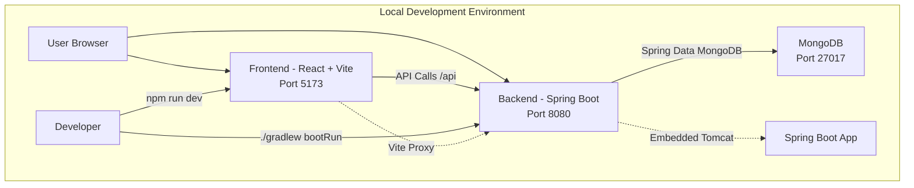
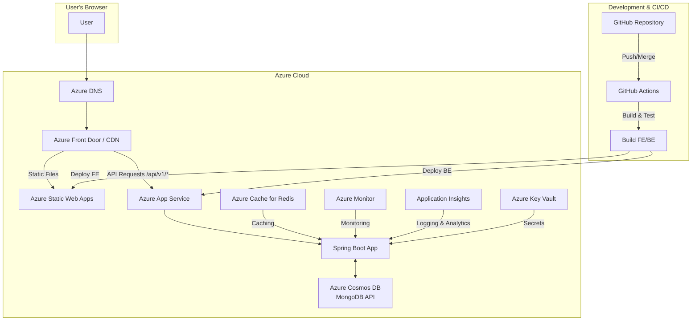
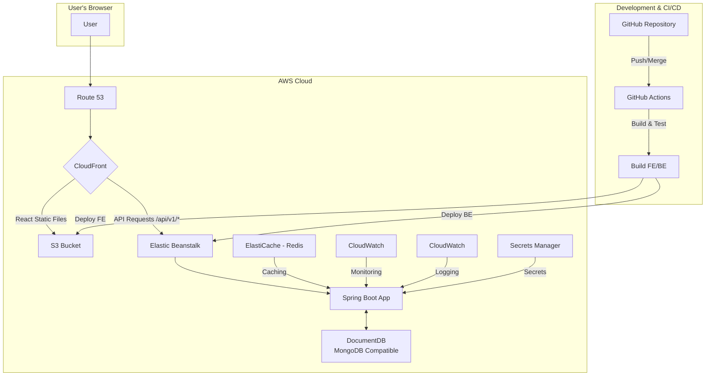
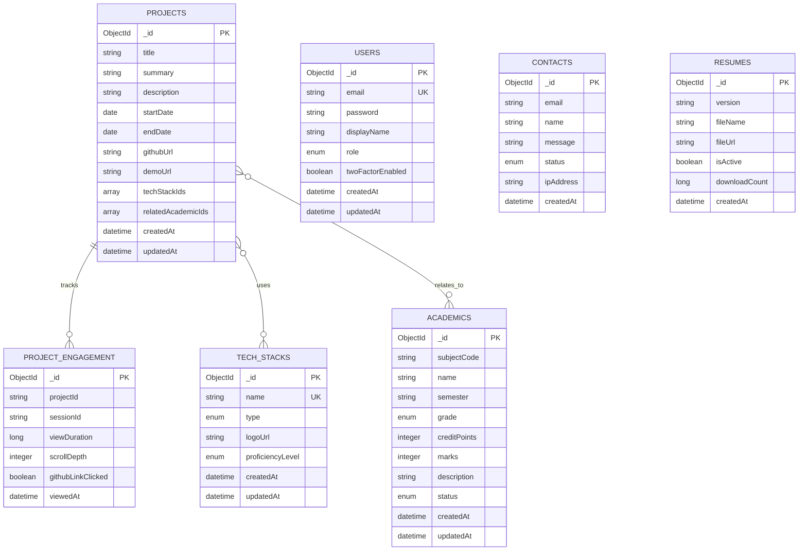

# Architecture Design Plan

> **Version**: 2.0.0  
> **Last Updated**: 2025-11-15  
> **Status**: Production Implementation Complete

## 1. Overview

This project is a fully implemented portfolio website in a local development environment, designed to be deployed to a cloud environment (Azure or AWS) with architecture optimized for future scalability, stability, and maintainability. The goal is to maximize development productivity by separating frontend and backend development and automating the deployment process through CI/CD pipelines.

## 2. Currently Implemented System Architecture

### Local Development Environment Configuration



### Current Tech Stack

| Category | Technology | Version | Purpose |
|----------|-----------|---------|---------|
| **Frontend** | React | 18.2.0 | UI Framework |
| **Frontend** | TypeScript | 5.5.3 | Type Safety |
| **Frontend** | Vite | 5.3.3 | Build Tool & Dev Server |
| **Frontend** | Styled Components | 6.1.11 | CSS-in-JS |
| **Frontend** | Zustand | 4.5.7 | State Management |
| **Backend** | Spring Boot | 3.3.4 | Application Framework |
| **Backend** | Java | 21 | Programming Language |
| **Database** | MongoDB | Latest | NoSQL Document Database |
| **ODM** | Spring Data MongoDB | 3.3.4 | Object-Document Mapping |
| **API Docs** | SpringDoc OpenAPI | 2.2.0 | API Documentation |
| **Build Tool** | Gradle | 8.10.2 | Backend Build |
| **Build Tool** | npm | Latest | Frontend Build |
| **Security** | Spring Security | 6.x | Authentication & Authorization |
| **Security** | JWT | 0.12.3 | Token-based Auth |
| **Security** | Google OAuth | 2.0 | Social Login |

### Key Implemented Features

1. **Portfolio Management**: Project, Academic, Tech Stack CRUD
2. **Authentication & Authorization**: Google OAuth + JWT + 2FA support
3. **Contact Management**: Contact form with spam protection
4. **Resume Management**: Multiple resume versions with download tracking
5. **Project Engagement Analytics**: Engagement tracking and analytics
6. **Internationalization**: i18n support via React i18next (Korean, English, Japanese)
7. **Responsive Design**: Perfect user experience across all devices
8. **API Versioning**: RESTful API based on `/api/v1`

## 3. Production Deployment Architecture

### Azure Deployment Architecture (Primary)



### AWS Deployment Architecture (Alternative)



### Architecture Component Descriptions

#### Azure Components

- **Azure DNS**: Domain name management and routing
- **Azure Front Door / CDN**: Global CDN and routing
- **Azure Static Web Apps**: React static file hosting
- **Azure App Service**: Spring Boot application deployment (PaaS)
- **Azure Cosmos DB (MongoDB API)**: Managed MongoDB database
- **Azure Cache for Redis**: In-memory caching
- **Azure Monitor**: Application monitoring
- **Application Insights**: Logging and performance analytics
- **Azure Key Vault**: Secret management

#### AWS Components

- **Route 53**: DNS service
- **CloudFront**: CDN and SSL/TLS certificates
- **S3**: Static file hosting
- **Elastic Beanstalk**: Spring Boot application deployment
- **DocumentDB**: MongoDB compatible database
- **ElastiCache (Redis)**: In-memory caching
- **CloudWatch**: Monitoring and logging
- **Secrets Manager**: Secret management

## 4. Database Architecture

### MongoDB Collection Structure



### Relationship Descriptions

- **Project ↔ TechStack**: Many-to-Many via `techStackIds` array (embedded references)
- **Project ↔ Academic**: Many-to-Many via `relatedAcademicIds` array (embedded references)
- **Project → ProjectEngagement**: One-to-Many (project engagement tracking)
- **User**: Standalone collection for authentication
- **Contact**: Standalone collection for contact form submissions
- **Resume**: Standalone collection for resume management

### Index Strategy

| Collection | Index | Type | Purpose |
|------------|-------|------|---------|
| `projects` | `endDate` | DESC | Sorting by date |
| `projects` | `isFeatured` | ASC | Featured projects |
| `academics` | `subjectCode` | ASC | Quick lookup |
| `academics` | `semester` | ASC | Semester filtering |
| `tech_stacks` | `name` | UNIQUE | Uniqueness & lookup |
| `users` | `email` | UNIQUE | Authentication |
| `contacts` | `email` | ASC | Duplicate detection |
| `resumes` | `isActive` | ASC | Primary resume |

## 5. Deployment Strategy

### A. Frontend (React)

#### Azure Static Web Apps

1. **Build**: `npm run build` → generates `dist/` directory
2. **Optimization**: 
   - Vite bundle optimization
   - Tree Shaking
   - Code Splitting (route-based)
   - Image optimization
3. **Deployment**: Automatic deployment via GitHub Actions
4. **CDN**: Global CDN via Azure Front Door

#### AWS S3 + CloudFront

1. **Build**: `npm run build` → generates `dist/` directory
2. **Upload**: Upload static files to S3 bucket
3. **Hosting**: Enable S3 static website hosting
4. **CDN**: CloudFront distribution and cache invalidation

### B. Backend (Spring Boot)

#### Azure App Service

1. **Build**: `./gradlew build` → generates JAR file
2. **Test**: Automatic unit and integration tests
3. **Deploy**: Deploy JAR to Azure App Service
4. **Environment Variables**: Inject secrets from Azure Key Vault
5. **Scaling**: Auto-scaling configuration

#### AWS Elastic Beanstalk

1. **Build**: `./gradlew build` → generates JAR file
2. **Test**: Automatic unit and integration tests
3. **Deploy**: Upload JAR to Elastic Beanstalk
4. **Environment Variables**: Inject secrets from AWS Secrets Manager
5. **Scaling**: Auto Scaling Group configuration

### C. Database

#### Azure Cosmos DB (MongoDB API)

- **Advantages**: Global distribution, auto-scaling, SLA guarantee
- **Connection**: Uses MongoDB connection string
- **Backup**: Automatic backup and Point-in-Time recovery

#### AWS DocumentDB

- **Advantages**: MongoDB compatible, managed service
- **Connection**: Uses MongoDB connection string
- **Backup**: Automatic backup and snapshots

#### Local Development

- **MongoDB**: Local MongoDB instance (Port 27017)
- **Connection String**: `mongodb://localhost:27017/portfolio`

## 6. CI/CD Pipeline with GitHub Actions

### Workflow Structure

```yaml
name: Deploy Portfolio

on:
  push:
    branches: [ main ]
  pull_request:
    branches: [ main ]

jobs:
  backend:
    runs-on: ubuntu-latest
    steps:
      - uses: actions/checkout@v3
      - name: Set up JDK 21
        uses: actions/setup-java@v3
        with:
          java-version: '21'
      - name: Run tests
        run: ./gradlew test
      - name: Build
        run: ./gradlew build
      - name: Deploy to Azure App Service
        uses: azure/webapps-deploy@v2
        with:
          app-name: portfolio-backend
          package: build/libs/*.jar

  frontend:
    runs-on: ubuntu-latest
    steps:
      - uses: actions/checkout@v3
      - name: Set up Node.js
        uses: actions/setup-node@v3
        with:
          node-version: '18'
      - name: Install dependencies
        run: npm ci
      - name: Build
        run: npm run build
      - name: Deploy to Azure Static Web Apps
        uses: Azure/static-web-apps-deploy@v1
        with:
          azure_static_web_apps_api_token: ${{ secrets.AZURE_STATIC_WEB_APPS_API_TOKEN }}
          repo_token: ${{ secrets.GITHUB_TOKEN }}
          app_location: "/frontend"
          output_location: "dist"
```

### Deployment Process

1. **Trigger**: Push or Merge to `main` branch
2. **Backend CI/CD**:
   - Java 21 and Gradle environment setup
   - `./gradlew test`: Run unit tests
   - `./gradlew build`: Generate JAR file
   - Deploy to Azure App Service or Elastic Beanstalk
3. **Frontend CI/CD**:
   - Node.js and npm environment setup
   - `npm ci`: Install dependencies
   - `npm run build`: Build React project
   - Deploy to Azure Static Web Apps or S3
   - CDN cache invalidation

## 7. Security and Performance Considerations

### Security

#### Implemented Security Features

- **JWT Authentication**: Access Token (1 hour) + Refresh Token (7 days)
- **Google OAuth 2.0**: Social login support
- **2FA**: TOTP-based two-factor authentication
- **Spring Security**: SecurityFilterChain configuration
- **CORS**: Environment-specific allowed origins
- **Security Headers**: HSTS, X-Frame-Options, Content-Type-Options
- **Input Sanitization**: XSS prevention via `InputSanitizer`
- **Rate Limiting**: Rate Limiting for Contact API (planned)

#### Security Headers

```java
.headers(headers -> headers
    .contentTypeOptions(cto -> cto.and())
    .httpStrictTransportSecurity(hsts -> hsts
        .maxAgeInSeconds(31536000)
        .includeSubdomains(true)
    )
    .frameOptions(fo -> fo.deny())
    .referrerPolicy(rp -> rp.policy(ReferrerPolicyHeaderWriter.ReferrerPolicy.STRICT_ORIGIN_WHEN_CROSS_ORIGIN))
)
```

### Performance Optimization

#### Frontend

- **CDN**: Static asset caching via Azure Front Door / CloudFront
- **Code Splitting**: Route-based lazy loading
- **Image Optimization**: WebP format, lazy loading
- **Bundle Optimization**: Tree Shaking, Minification

#### Backend

- **Redis Caching**: TechStackService caching (1 hour TTL)
- **Database Optimization**: 
  - Index setup
  - Query optimization
  - Connection pooling
- **API Response Optimization**: 
  - Pagination
  - DTO projection
  - Selective field return

### Monitoring

#### Azure

- **Azure Monitor**: Application performance monitoring
- **Application Insights**: 
  - Logging and tracing
  - Performance metrics
  - Exception tracking
- **Log Analytics**: Centralized log management

#### AWS

- **CloudWatch**: 
  - Application logs
  - Metrics collection
  - Alarm configuration
- **X-Ray**: Distributed tracing (optional)

## 8. Scalability Considerations

### Horizontal Scaling

- **Frontend**: Auto-scaling via CDN
- **Backend**: 
  - Azure App Service: Auto-scaling
  - AWS Elastic Beanstalk: Auto Scaling Group
- **Database**: 
  - Azure Cosmos DB: Automatic partitioning and scaling
  - AWS DocumentDB: Read replicas

### Vertical Scaling

- **App Service Plan**: Upgrade to higher tier
- **Database**: Upgrade to higher performance tier

### Caching Strategy

- **Redis**: 
  - TechStack data caching
  - Session data (optional)
  - Rate limiting data

## 9. Disaster Recovery

### Backup Strategy

- **Database**: 
  - Azure Cosmos DB: Automatic backup (7-day retention)
  - AWS DocumentDB: Automatic snapshots
- **Application**: 
  - Source code backup in GitHub repository
  - Build artifact storage

### Recovery Procedures

1. **Database Recovery**: Point-in-Time recovery or snapshot restore
2. **Application Recovery**: Redeploy code from GitHub
3. **DNS Recovery**: DNS record recovery

## 10. Cost Optimization

### Azure

- **Static Web Apps**: Free tier available
- **App Service**: Start from Basic tier
- **Cosmos DB**: Request Unit (RU) based billing

### AWS

- **S3**: Usage-based billing
- **Elastic Beanstalk**: EC2 instance costs
- **DocumentDB**: Instance-based billing

### Optimization Strategies

- **CDN Caching**: Maximize cache hit rate
- **Database Optimization**: Reduce RU through query optimization
- **Auto Scaling**: Scale up only when needed

---

**Document Version**: 2.0.0  
**Last Updated**: 2025-11-15  
**Maintained By**: Development Team
