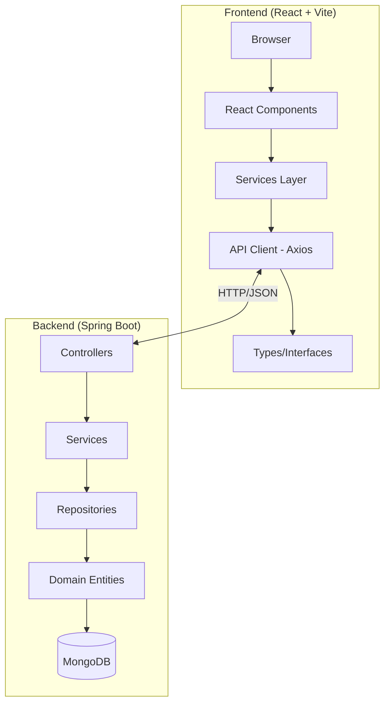
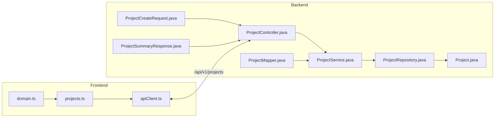
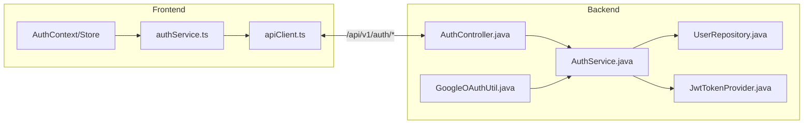
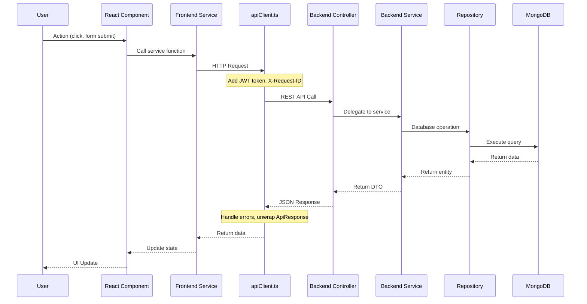
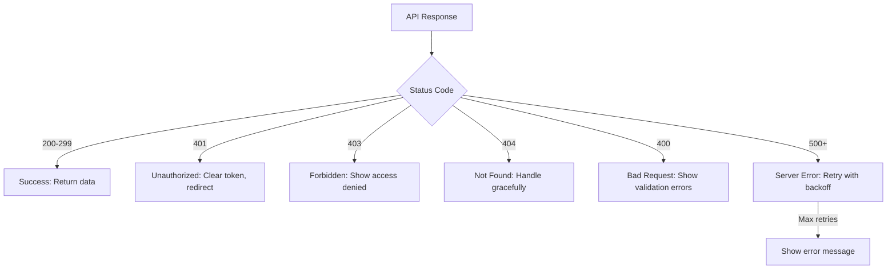

# Frontend-Backend Integration Analysis

> **Version**: 1.0.0  
> **Last Updated**: 2025-12-22  
> **Status**: Active

## 1. Executive Summary

This document provides a comprehensive analysis of the frontend-backend integration in the MyTechPortfolio project. It identifies all related files, traces logic flows, and documents the data flow between React frontend and Spring Boot backend.

---

## 2. Architecture Overview

### 2.1 System Stack



### 2.2 Technology Mapping

| Layer | Frontend | Backend |
|-------|----------|---------|
| **Framework** | React 18 + TypeScript | Spring Boot 3.3 + Java 21 |
| **Build Tool** | Vite 5.3 | Gradle 8.10 |
| **State Management** | Zustand | - |
| **API Client** | Axios | - |
| **Database** | - | MongoDB |
| **Authentication** | JWT + Google OAuth | Spring Security + JWT |

---

## 3. File Mapping: Frontend ↔ Backend

### 3.1 Projects Feature



**Related Files:**

| Frontend | Purpose | Backend | Purpose |
|----------|---------|---------|---------|
| [`services/projects.ts`](file:///d:/UTS/MyPortFolio/frontend/src/services/projects.ts) | API calls | [`controller/ProjectController.java`](file:///d:/UTS/MyPortFolio/backend/src/main/java/com/mytechfolio/portfolio/controller/ProjectController.java) | REST endpoints |
| [`types/domain.ts`](file:///d:/UTS/MyPortFolio/frontend/src/types/domain.ts) | TypeScript interfaces | [`dto/request/ProjectCreateRequest.java`](file:///d:/UTS/MyPortFolio/backend/src/main/java/com/mytechfolio/portfolio/dto/request/ProjectCreateRequest.java) | Request DTO |
| [`types/api.ts`](file:///d:/UTS/MyPortFolio/frontend/src/types/api.ts) | API response types | [`dto/response/ProjectDetailResponse.java`](file:///d:/UTS/MyPortFolio/backend/src/main/java/com/mytechfolio/portfolio/dto/response/ProjectDetailResponse.java) | Response DTO |
| [`services/apiClient.ts`](file:///d:/UTS/MyPortFolio/frontend/src/services/apiClient.ts) | Axios instance | [`service/ProjectService.java`](file:///d:/UTS/MyPortFolio/backend/src/main/java/com/mytechfolio/portfolio/service/ProjectService.java) | Business logic |
|  |  | [`repository/ProjectRepository.java`](file:///d:/UTS/MyPortFolio/backend/src/main/java/com/mytechfolio/portfolio/repository/ProjectRepository.java) | Data access |
|  |  | [`domain/Project.java`](file:///d:/UTS/MyPortFolio/backend/src/main/java/com/mytechfolio/portfolio/domain/Project.java) | Entity |
|  |  | [`mapper/ProjectMapper.java`](file:///d:/UTS/MyPortFolio/backend/src/main/java/com/mytechfolio/portfolio/mapper/ProjectMapper.java) | DTO ↔ Entity |

---

### 3.2 Authentication Feature



**Related Files:**

| Frontend | Purpose | Backend | Purpose |
|----------|---------|---------|---------|
| [`services/authService.ts`](file:///d:/UTS/MyPortFolio/frontend/src/services/authService.ts) | Auth API calls | [`controller/AuthController.java`](file:///d:/UTS/MyPortFolio/backend/src/main/java/com/mytechfolio/portfolio/controller/AuthController.java) | Auth endpoints |
| Store (Zustand) | Token storage | [`service/AuthService.java`](file:///d:/UTS/MyPortFolio/backend/src/main/java/com/mytechfolio/portfolio/service/AuthService.java) | Auth logic |
|  |  | [`security/JwtTokenProvider.java`](file:///d:/UTS/MyPortFolio/backend/src/main/java/com/mytechfolio/portfolio/security/JwtTokenProvider.java) | JWT generation |
|  |  | [`security/JwtAuthenticationFilter.java`](file:///d:/UTS/MyPortFolio/backend/src/main/java/com/mytechfolio/portfolio/security/JwtAuthenticationFilter.java) | JWT validation |
|  |  | [`dto/auth/GoogleLoginRequest.java`](file:///d:/UTS/MyPortFolio/backend/src/main/java/com/mytechfolio/portfolio/dto/auth/GoogleLoginRequest.java) | Login DTO |
|  |  | [`dto/auth/LoginResponse.java`](file:///d:/UTS/MyPortFolio/backend/src/main/java/com/mytechfolio/portfolio/dto/auth/LoginResponse.java) | Response DTO |

---

### 3.3 Additional Domain Mappings

| Domain | Frontend Service | Backend Controller | Backend Service | Repository | Domain Entity |
|--------|------------------|-------------------|----------------|------------|---------------|
| **Academics** | `academics.ts` | `AcademicController.java` | `AcademicService.java` | `AcademicRepository.java` | `Academic.java` |
| **TechStacks** | `techStacks.ts` | `TechStackController.java` | `TechStackService.java` | `TechStackRepository.java` | `TechStack.java` |
| **Testimonials** | `testimonials.ts` | `TestimonialController.java` | `TestimonialService.java` | `TestimonialRepository.java` | `Testimonial.java` |
| **Contact** | `email/` | `ContactController.java` | `ContactService.java` | `ContactRepository.java` | `Contact.java` |
| **Analytics** | `analytics.ts` | `ProjectEngagementController.java` | `ProjectEngagementService.java` | `ProjectEngagementRepository.java` | `ProjectEngagement.java` |
| **Resume** | (Admin) | `ResumeController.java` | `ResumeService.java` | `ResumeRepository.java` | `Resume.java` |

---

## 4. Data Flow Analysis

### 4.1 Request Flow (Frontend → Backend)



### 4.2 API Client Configuration

**Location**: [`frontend/src/services/apiClient.ts`](file:///d:/UTS/MyPortFolio/frontend/src/services/apiClient.ts)

**Features:**
- Base URL configuration (dev/prod)
- JWT token injection via interceptor
- Request ID generation (`X-Request-ID`)
- Response unwrapping (`ApiResponse.data`)
- Error handling with status codes
- Retry logic with exponential backoff

### 4.3 API Response Format

```typescript
// Frontend expects (types/api.ts)
interface ApiResponse<T> {
  success: boolean
  data: T
  error: string | null
}

interface Page<T> {
  page: number
  size: number
  total: number
  items: T[]
}
```

```java
// Backend provides (dto/response/ApiResponse.java)
public class ApiResponse<T> {
    private boolean success;
    private T data;
    private String error;
    private String message;
}
```

---

## 5. API Endpoints Mapping

### 5.1 Projects API

| HTTP Method | Endpoint | Frontend Function | Backend Method |
|-------------|----------|-------------------|----------------|
| GET | `/api/v1/projects` | `getProjects(params)` | `ProjectController.getProjects()` |
| GET | `/api/v1/projects/{id}` | `getProject(id)` | `ProjectController.getProject()` |
| POST | `/api/v1/projects` | `createProject(request)` | `ProjectController.createProject()` |
| PUT | `/api/v1/projects/{id}` | `updateProject(id, request)` | `ProjectController.updateProject()` |
| DELETE | `/api/v1/projects/{id}` | `deleteProject(id)` | `ProjectController.deleteProject()` |

### 5.2 Authentication API

| HTTP Method | Endpoint | Frontend Function | Backend Method |
|-------------|----------|-------------------|----------------|
| POST | `/api/v1/auth/google` | `loginWithGoogle(credential)` | `AuthController.googleAuth()` |
| POST | `/api/v1/auth/refresh` | `refreshToken()` | `AuthController.refreshToken()` |
| POST | `/api/v1/auth/logout` | `logout()` | `AuthController.logout()` |
| GET | `/api/v1/auth/profile` | `getCurrentUser()` | `AuthController.getProfile()` |

---

## 6. Configuration Files

### 6.1 Frontend Configuration

| File | Purpose |
|------|---------|
| [`vite.config.ts`](file:///d:/UTS/MyPortFolio/frontend/vite.config.ts) | Dev proxy (`/api` → `localhost:8080`) |
| [`src/config/api.config.ts`](file:///d:/UTS/MyPortFolio/frontend/src/config/api.config.ts) | API constants, timeouts |
| `.env` | `VITE_API_BASE_URL`, `VITE_USE_BACKEND_API` |

### 6.2 Backend Configuration

| File | Purpose |
|------|---------|
| [`WebConfig.java`](file:///d:/UTS/MyPortFolio/backend/src/main/java/com/mytechfolio/portfolio/config/WebConfig.java) | CORS configuration |
| [`SecurityConfig.java`](file:///d:/UTS/MyPortFolio/backend/src/main/java/com/mytechfolio/portfolio/config/SecurityConfig.java) | Spring Security setup |
| [`ApiConstants.java`](file:///d:/UTS/MyPortFolio/backend/src/main/java/com/mytechfolio/portfolio/constants/ApiConstants.java) | API paths, versions |
| `application.properties` | DB connection, JWT secrets |

---

## 7. Error Handling Flow

### 7.1 Frontend Error Handling



### 7.2 Backend Error Handling

| Exception | HTTP Status | Handler |
|-----------|-------------|---------|
| `ResourceNotFoundException` | 404 | `GlobalExceptionHandler` |
| `ValidationException` | 400 | `GlobalExceptionHandler` |
| `AuthenticationException` | 401 | `SecurityConfig` |
| `AccessDeniedException` | 403 | `SecurityConfig` |
| `Exception` | 500 | `GlobalExceptionHandler` |

---

## 8. Type Safety: Frontend ↔ Backend

### 8.1 Project Types Mapping

```typescript
// Frontend: types/domain.ts
interface ProjectSummary {
  id: number
  title: string
  summary: string
  startDate: string    // YYYY-MM-DD
  endDate: string      // YYYY-MM-DD
  techStacks: string[]
  imageUrl?: string
  featured?: boolean
}
```

```java
// Backend: dto/response/ProjectSummaryResponse.java
public class ProjectSummaryResponse {
    private String id;          // MongoDB ObjectId
    private String title;
    private String summary;
    private LocalDate startDate;
    private LocalDate endDate;
    private List<String> techStacks;
    private String imageUrl;
    private Boolean featured;
}
```

> [!IMPORTANT]
> **Type Mismatch**: Frontend uses `number` for `id`, but backend uses `String` (MongoDB ObjectId). Consider aligning types.

---

## 9. Related Documentation

### 9.1 Architecture Documents
- [ADR-008: Layered Architecture](file:///d:/UTS/MyPortFolio/docs/ADR/ADR-008-Layered-Architecture.md)
- [Architecture Design](file:///d:/UTS/MyPortFolio/docs/Architecture/architecture-design.md)
- [Frontend Architecture Overview](file:///d:/UTS/MyPortFolio/docs/frontend/architecture-overview.md)

### 9.2 Connectivity Documents
- [Backend Connectivity Verification](file:///d:/UTS/MyPortFolio/docs/Backend/BACKEND_CONNECTIVITY_VERIFICATION.md)
- [Connection Verification Checklist](file:///d:/UTS/MyPortFolio/docs/frontend/CONNECTION_VERIFICATION_CHECKLIST.md)

### 9.3 Backend Documentation
- [Backend Documentation Plan](file:///d:/UTS/MyPortFolio/docs/Backend/BACKEND_DOCUMENTATION_PLAN.md)

---

## 10. Summary: All Related Files

### Frontend Files
| Category | Files |
|----------|-------|
| **Services** | `apiClient.ts`, `projects.ts`, `authService.ts`, `academics.ts`, `techStacks.ts`, `testimonials.ts`, `analytics.ts` |
| **Types** | `domain.ts`, `api.ts` |
| **Config** | `vite.config.ts`, `api.config.ts`, `.env` |
| **State** | `stores/*.ts` (Zustand) |

### Backend Files
| Category | Files |
|----------|-------|
| **Controllers** | `ProjectController.java`, `AuthController.java`, `AcademicController.java`, `TechStackController.java`, `TestimonialController.java`, `ContactController.java`, `ResumeController.java`, `ProjectEngagementController.java` |
| **Services** | `ProjectService.java`, `AuthService.java`, `AcademicService.java`, `TechStackService.java`, `TestimonialService.java`, `ContactService.java`, `EmailService.java`, `ResumeService.java`, `ProjectEngagementService.java` |
| **Repositories** | `ProjectRepository.java`, `UserRepository.java`, `AcademicRepository.java`, `TechStackRepository.java`, `TestimonialRepository.java`, `ContactRepository.java`, `ResumeRepository.java`, `ProjectEngagementRepository.java` |
| **Domain** | `Project.java`, `User.java`, `Academic.java`, `TechStack.java`, `Testimonial.java`, `Contact.java`, `Resume.java`, `ProjectEngagement.java` |
| **DTOs** | `dto/request/*.java`, `dto/response/*.java`, `dto/auth/*.java` |
| **Mappers** | `mapper/*.java` |
| **Config** | `WebConfig.java`, `SecurityConfig.java`, `ApiConstants.java` |
| **Security** | `JwtTokenProvider.java`, `JwtAuthenticationFilter.java`, `SecurityConstants.java` |
| **Exception** | `GlobalExceptionHandler.java`, `ResourceNotFoundException.java` |

---

**Document Version**: 1.0.0  
**Last Updated**: 2025-12-22  
**Maintained By**: Development Team
