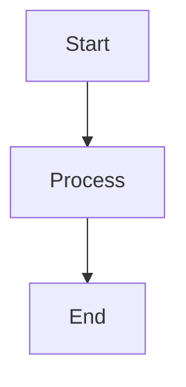

# Documentation Standards

> **Version**: 1.0.0  
> **Last Updated**: 2025-11-17  
> **Status**: Active

## Overview

This document defines the standards, guidelines, and best practices for writing and maintaining documentation in the MyTechPortfolio project.

---

## File Naming Conventions

### Markdown Files

- **Title Case**: Use Title Case for all markdown files
  - ✅ `API-Specification.md`
  - ✅ `Getting-Started.md`
  - ❌ `api-specification.md`
  - ❌ `getting_started.md`

### Directories

- **Title Case**: Use Title Case for directories
  - ✅ `Best-Practices/`
  - ✅ `Architecture/`
  - ❌ `best-practices/`
  - ❌ `architecture/`

### README Files

- Always capitalized: `README.md`
- Each directory should have a `README.md` index

---

## Document Structure

### Frontmatter Template

Every document must include frontmatter:

```markdown
---
title: "Document Title"
version: "1.0.0"
last_updated: "YYYY-MM-DD"
status: "active|deprecated|draft"
category: "Guide|Reference|Tutorial|Specification"
audience: ["Developers", "DevOps Engineers"]
prerequisites: ["Getting-Started.md"]
related_docs: ["Related-Doc.md"]
maintainer: "Development Team"
---
```

### Required Frontmatter Fields

- `title`: Document title
- `version`: Version number (semantic versioning)
- `last_updated`: ISO 8601 date (YYYY-MM-DD)
- `status`: `active`, `deprecated`, or `draft`
- `category`: Document category
- `audience`: Target audience array
- `related_docs`: Related documents array

### Optional Frontmatter Fields

- `prerequisites`: Prerequisite documents
- `maintainer`: Maintainer name or team
- `reviewer`: Reviewer name
- `tags`: Tags for categorization

### Document Header

```markdown
# Document Title

> **Version**: 1.0.0  
> **Last Updated**: YYYY-MM-DD  
> **Status**: Active

## Overview

[Purpose and scope of the document]
```

---

## Writing Style

### Voice and Tone

- **Active Voice**: Prefer active voice over passive
  - ✅ "The system processes requests"
  - ❌ "Requests are processed by the system"

- **Clear and Concise**: Get to the point quickly
- **Professional**: Maintain professional tone
- **Inclusive**: Use inclusive language

### Language

- **English**: All documentation in English
- **Spelling**: Use American English spelling
- **Grammar**: Follow standard English grammar rules
- **Terminology**: Use consistent terminology (create glossary)

### Code Examples

- **Syntax Highlighting**: Always use syntax highlighting
- **Complete Examples**: Provide complete, runnable examples
- **Comments**: Add comments for clarity
- **Context**: Provide context for code examples

```markdown
```typescript
// Example: API call with error handling
const response = await api.get('/api/v1/projects')
if (response.data.success) {
  return response.data.data
}
```
```

---

## Content Organization

### Table of Contents

For documents longer than 500 lines, include a table of contents:

```markdown
## Table of Contents

1. [Section 1](#section-1)
2. [Section 2](#section-2)
3. [Subsection 2.1](#subsection-21)
```

### Section Headers

- Use `##` for main sections
- Use `###` for subsections
- Use `####` for sub-subsections
- Maintain consistent hierarchy

### Lists

- Use numbered lists for sequential steps
- Use bullet lists for non-sequential items
- Keep lists concise
- Use consistent formatting

---

## Formatting Guidelines

### Emphasis

- **Bold**: For important terms, UI elements, file names
- *Italic*: For emphasis, variable names, placeholders
- `Code`: For code, commands, file paths

### Links

- **Internal Links**: Use relative paths
  ```markdown
  [Getting Started](./Getting-Started.md)
  ```

- **External Links**: Use full URLs
  ```markdown
  [React Documentation](https://react.dev)
  ```

- **Link Text**: Use descriptive link text
  - ✅ "See the Getting Started guide"
  - ❌ "Click here"

### Tables

Use tables for structured data:

```markdown
| Column 1 | Column 2 | Column 3 |
|----------|----------|----------|
| Data 1   | Data 2   | Data 3   |
```

### Code Blocks

- Specify language for syntax highlighting
- Include file path comments when relevant
- Keep code blocks focused and relevant

---

## Diagrams and Visuals

### Mermaid Diagrams

Use Mermaid for diagrams:

```markdown

```

### Images

- Use descriptive alt text
- Optimize image sizes
- Store in appropriate directories
- Reference with relative paths

---

## Cross-References

### Related Documentation

Always include a "Related Documentation" section:

```markdown
## Related Documentation

- [Related Doc 1](./Related-Doc-1.md)
- [Related Doc 2](./Related-Doc-2.md)
```

### See Also

Add "See also" links where relevant:

```markdown
See also:
- [API Specification](../Specifications/API-Specification.md)
- [Database Specification](../Specifications/Database-Specification.md)
```

---

## Review Process

### Before Submitting

- [ ] Frontmatter is complete and accurate
- [ ] All links work correctly
- [ ] Code examples are tested
- [ ] Spelling and grammar checked
- [ ] Formatting is consistent
- [ ] Related docs are linked

### Review Checklist

- Content accuracy
- Completeness
- Clarity and readability
- Formatting consistency
- Link validation
- Code example accuracy

---

## Maintenance

### Update Frequency

- **Active Development**: Update weekly
- **Major Changes**: Update immediately
- **Quarterly Review**: Full content audit

### Version Control

- Commit documentation changes with code changes
- Use descriptive commit messages
- Tag major documentation updates

### Deprecation

When deprecating documents:

1. Update status to `deprecated` in frontmatter
2. Add deprecation notice at top of document
3. Link to replacement document
4. Remove from main navigation after grace period

---

## Examples

### Good Documentation

```markdown
---
title: "API Authentication Guide"
version: "1.0.0"
last_updated: "2025-11-17"
status: "active"
category: "Guide"
audience: ["Developers"]
related_docs: ["API-Specification.md"]
---

# API Authentication Guide

> **Version**: 1.0.0  
> **Last Updated**: 2025-11-17

## Overview

This guide explains how to authenticate API requests using JWT tokens.

## Authentication

### Getting a Token

To get an authentication token:

1. Send a POST request to `/api/v1/auth/login`
2. Include credentials in the request body
3. Receive a JWT token in the response

Example:

```typescript
const response = await api.post('/api/v1/auth/login', {
  username: 'user',
  password: 'password'
})
const token = response.data.token
```

## Related Documentation

- [API Specification](../Specifications/API-Specification.md)
```

### Bad Documentation

```markdown
# auth

how to auth

send request to /api/v1/auth/login

[click here](./some-doc.md)
```

---

## Tools and Resources

### Recommended Tools

- **Markdown Editor**: VS Code with Markdown extensions
- **Link Checker**: `markdown-link-check`
- **Linter**: `markdownlint`
- **Preview**: Markdown preview in VS Code

### Resources

- [Markdown Guide](https://www.markdownguide.org/)
- [Keep a Changelog](https://keepachangelog.com/)
- [Semantic Versioning](https://semver.org/)

---

## Related Documentation

- [Contributing Guide](./Contributing-Guide.md)
- [README.md](../README.md)
- [Best Practices](../Best-Practices/README.md)

---

**Last Updated**: 2025-11-17  
**Maintained By**: Development Team

